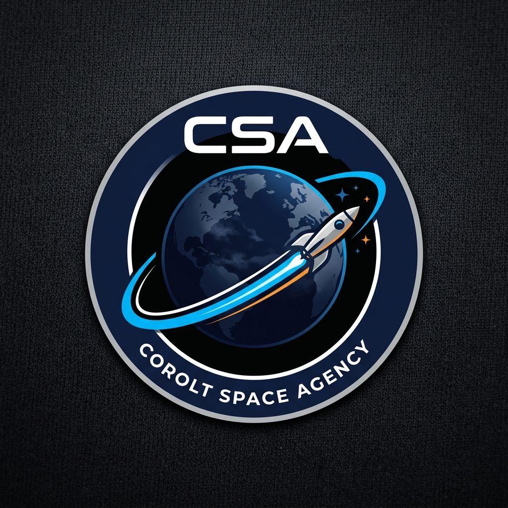

# 🚀 COROLT SPACE AGENCY (CSA)

> *"Ad Astra Per Scientiam"* — To the stars through science.

Welcome to the mission operations headquarters of the **Corolt Space Agency (CSA)**. This repository hosts the official flight log, engineering blueprints, launch vehicle fleet specifications, and public press releases for our space exploration program.

---

## 🛰️ Space Program Objectives

1. **Phase I — Foundations & Suborbital Spaceflight**:
   - Initial solid rocket motor and liquid-fuel propulsion development.
   - Atmospheric baseline sampling and real-time flight telemetry streaming with *Kerbalism* sensors.
   - Reaching suborbital space across the Kármán line (70 km) and recovering scientific payloads.

2. **Phase II — Orbital Capability & Communications Network**:
   - Achieving stable Low Kerbin Orbit (LKO at ~80 km).
   - Deploying the *CoroltNet* autonomous relay satellite constellation for uninterrupted telemetry.
   - Long-duration Van Allen radiation belt sampling and materials science.

3. **Phase III — The Kerbin-Mun-Minmus System**:
   - Uncrewed robotic orbiters and landers to the Mun and Minmus.
   - Resource prospecting, in-situ science, and soil sample return to Kerbin.
   - First crewed missions with closed-loop life support (O2, food, water, and CO2 scrubbing).

4. **Phase IV — Interplanetary Exploration**:
   - Interplanetary transfer missions to Duna and Eve calculated with *KSP TOT* and *Transfer Window Planner*.

---

## 📁 Repository Structure

* **`missions/`**: Engineering post-flight reports, telemetry logs, anomaly investigations, and science yielded.
* **`vehicles/`**: Launcher fleet specifications, staging breakdowns, $\Delta v$ budgets, TWR curves, and *Kronal Vessel Viewer* blueprints.
* **`science/`**: Interactive Kerbin science matrix and telemetry syncing tools.
* **`social_media/`**: Agency press releases, launch threads, and mission briefings.
* **`tools/`**: Python engineering suite: high-rate telemetry recording, RK4 numerical trajectory simulation, and aero calibration.
* **`scripts/`**: kOS KerboScript autonomous ascent guidance and recovery routines.
* **`assets/`**: High-resolution blueprints, vehicle schematics, mission badges, and telemetry plots.
