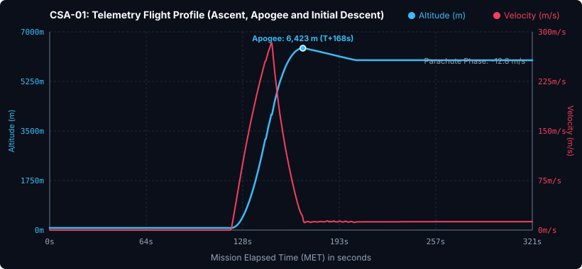

# 📋 Informe de Missió: CSA-01 «Vol Inaugural Corolt-I»

* **Data del Llançament**: Any 1, Dia 1
* **Operador de Vol / Comandament**: Control de Missions CSA (Cap Canaveral de Kerbin)
* **Vehicle Llançador**: [Corolt-I (Coet Sonda)](/vehicles/corolt-1)
* **Estat de la Missió**: 🟢 ÈXIT TOTAL (Vol Suborbital i Recuperació)

---

## 🎯 Objectius de la Missió
1. **Objectiu Primari**: Enlairament autònom, prova de combustió del motor sòlid SRM-L i estabilitat aerodinàmica. *(Completat)*
2. **Objectiu Secundari**: Desplegament de paracaigudes a l'apogeu i recuperació intacta de la càrrega útil. *(Completat)*
3. **Objectiu Tecnològic**: Enregistrament de telemetria en directe i transmissió de dades a l'estació de seguiment. *(Completat)*

---

## 📊 Telemetria Oficial de Vol (Dades Registrades)

Aquestes dades han estat capturades en directe durant el vol mitjançant el nostre enllaç de telemetria Telemachus:

| Paràmetre de Vol | Valor Assolit |
| :--- | :--- |
| **Altitud Màxima (Apoapsis)** | **6.423,4 m (6,42 km)** |
| **Velocitat Màxima de Superfície** | **282,7 m/s (1.017 km/h)** |
| **Acceleració Màxima** | **2,37 G** |
| **Pressió Dinàmica Màxima (Max Q)** | **27,35 kPa** |
| **Durada de Vol Registrada** | **321,2 segons (5m 21s)** |
| **Velocitat de Descens amb Paracaigudes** | **12,8 m/s** |

### Gràfica de Vol (Altitud i Velocitat vs Temps)

---

## 📝 Resum del Vol
El llançador suborbital **Corolt-I** s'ha enlairat amb èxit des de la plataforma principal del Centre Espacial. L'estabilització passiva per les 4 aletes aerodinàmiques ha demostrat un comportament impecable, mantenint una trajectòria vertical estricta sense desviació.

Després de la fi de combustió del motor SRM-L als ~26 segons de vol, el vehicle va continuar ascendint per inèrcia fins a assolir un apogeu de **6.423 metres**. A la fase de descens, el paracaigudes miniatura es va desplegar correctament reduint la velocitat a 12,8 m/s fins a l'impacte suau sobre la superfície.

---

## 📸 Plànol del Vehicle de la Missió

