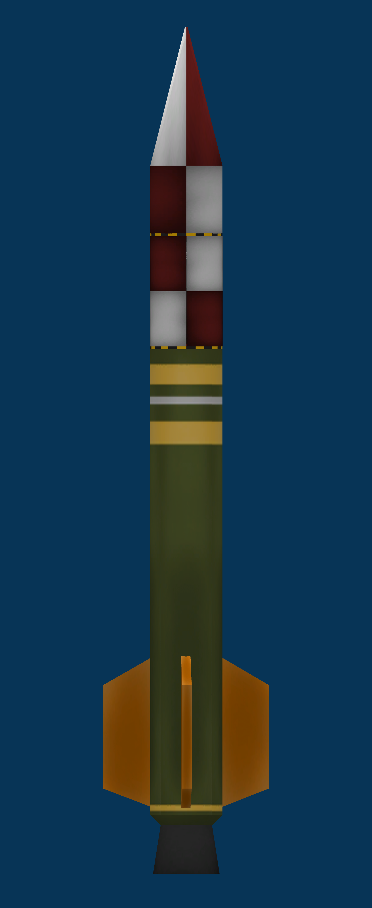

# 📋 Mission Report: CSA-02 «Corolt-Ib Operational Flight»

* **Launch Date**: Year 1, Day 2
* **Flight Director / Operations**: CSA Mission Control (Kerbin Launch Complex)
* **Launch Vehicle**: [Corolt-Ib (Upgraded Sounding Rocket)](/vehicles/corolt-1b)
* **Mission Status**: 🟢 FULL SUCCESS (Suborbital Flight, Continuous Telemetry, and Recovery)

---

## 🎯 Mission Objectives
1. **Electrical Endurance Objective (Power Storage)**: Validate the 3-battery bank to keep onboard computers and telemetry online through entire mission profile. *(Completed)*
2. **Stability Objective**: Test the 4-fin cruciform aerodynamic layout for rigid vertical flight. *(Completed)*
3. **Efficient Recovery Objective**: Controlled fast-descent freefall from apogee down to ~1,900 m and soft parachute touchdown. *(Completed)*
4. **Technological Objective**: Full second-by-second high-rate telemetry capture in database. *(Completed)*

---

## 📊 Official Flight Telemetry (Recorded Data)

Captured in real time during flight via the Telemachus telemetry downlink:

| Flight Parameter | Value Achieved |
| :--- | :--- |
| **Peak Altitude (Apoapsis)** | **4,056.8 m (4.06 km)** |
| **Maximum Surface Speed** | **163.0 m/s (586.8 km/h)** *(at T+34s)* |
| **Parachute Deployment Altitude** | **1,897.8 m** *(at T+76s)* |
| **Peak Opening Deceleration** | **18.31 G** |
| **Landing Elevation** | **62.0 m** *(Kerbin Shores)* |
| **Active Flight Duration** | **504.5 seconds (8m 24s)** |
| **Parachute Descent Velocity** | **~8.8 - 9.5 m/s** |

### Flight Plot (Altitude & Speed vs Time)

---

## 📝 Flight Summary
The upgraded **Corolt-Ib** suborbital sounding rocket lifted off smoothly from the primary launchpad at Kerbin Space Center. Aerodynamic stabilization with the new 4-fin cruciform layout provided a razor-sharp profile without rolling drift.

The SRM-L solid rocket motor burned for 34 seconds, achieving a peak speed of 163 m/s and propelling the vehicle to an apogee of **4,056 meters**. Per flight plan, the vehicle maintained a rapid ballistic freefall until reaching 1,898 meters AGL, when the recovery parachute deployed.

Touchdown occurred on the shores near KSC with all battery packs operational and scientific flight logs intact.

---

## 📸 Mission Vehicle Blueprint

