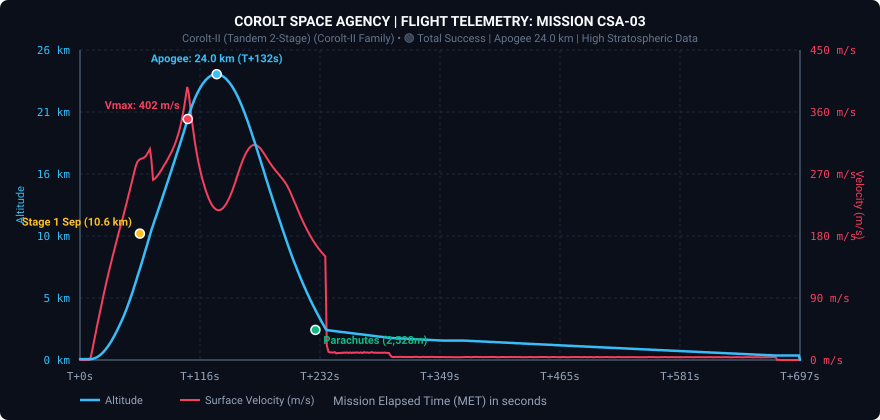

# 📋 Informe de Missió: CSA-03 «Assalt Estratosfèric Corolt-II»

* **Data del Llançament**: Any 1, Dia 18 (01h 07m 08s)
* **Operador de Vol / Comandament**: Control de Missions CSA (Cap Canaveral de Kerbin)
* **Vehicle Llançador**: [Corolt-II (Multietapa)](/vehicles/corolt-2)
* **Estat de la Missió**: 🟢 ÈXIT TOTAL (Vol Estratosfèric Multietapa i Recuperació de Ciència)

---

## 🎯 Objectius de la Missió
1. **Objectiu Multietapa**: Validació de la seqüència de separació explosiva en vol i encesa del segon motor en atmosfera fina. *(Completat)*
2. **Objectiu d'Altitud**: Superar la troposfera i assolir l'alta atmosfera (*Kerbin Flying High* >18-20 km). *(Completat - 23,97 km assolit!)*
3. **Objectiu Científic**: Execució i registre dels nous experiments d'enginyeria i radiació `SR.Payload.02` a l'alta atmosfera. *(Completat)*
4. **Objectiu de Recuperació**: Aterratge suau i recuperació de la càrrega útil a les praderies de Kerbin (*Grasslands*). *(Completat)*

---

## 📊 Telemetria Oficial de Vol (Dades Registrades)

Aquestes dades han estat capturades en directe durant el vol mitjançant el nostre enllaç de telemetria Telemachus:

| Paràmetre de Vol | Valor Assolit |
| :--- | :--- |
| **Altitud Màxima (Apoapsis)** | **23.967,9 m (23,97 km)** *(a T+122s)* |
| **Velocitat Màxima de Superfície** | **401,6 m/s (1.445,8 km/h)** *(a T+94s, Alt: 20,2 km)* |
| **Separació de Primera Etapa** | **10.608 m** *(a T+58s, velocitat 308 m/s)* |
| **Encesa de Segona Etapa** | Immediata a 11.400 m |
| **Desplegament del Paracaigudes** | **2.527,8 m** *(a T+228s)* |
| **Acceleració Màxima en Obertura** | **19,45 G** |
| **Durada Total de Vol Actiu** | **687 segons (11m 27s)** |
| **Lloc d'Aterratge** | Praderies de Kerbin (*Kerbin Grasslands*) |
| **Estat del Vehicle** | **100% Recuperat i Intacte** |

### Gràfica de Vol (Altitud i Velocitat vs Temps)

---

## 🔬 Rendiment Científic (Kerbalism & R+D)
Durant el pas per l'alta atmosfera, la computadora de bord ha completat amb èxit:
* **`SRExperiment04@KerbinFlyingHigh`**: Experiments d'enginyeria estructural i aerodinàmica a l'alta atmosfera.
* **`kerbalism_TELEMETRY@KerbinFlyingHighGrasslands`**: Paquet complet de telemetria ambiental sobre les Praderies de Kerbin.
* **Ciència total recuperada al laboratori**: Nova collita record de ciència que eleva el total de l'agència a **6,54 punts** disponibles!

---

## 📝 Resum del Vol
La missió **CSA-03** ha marcat una fita històrica per a la Corolt Space Agency amb el llançament inaugural del vehicle multietapa **Corolt-II**. 

El booster SRM-XL de 0.625m ha impulsat el vehicle de manera impecable durant 58 segons fins a superar els 10.600 metres d'altitud. La separació d'etapa mitjançant el desacoblador `SR.Decoupler` s'ha executat amb netedat absoluta, donant pas a l'encesa del motor superior SRM-L. Aquest segon impuls en l'aire fi ha accelerat la càrrega fins als **401,6 m/s (Mach 1.2+)**, catapultant la sonda fins a un apogeu de **23.968 metres** en plena estratosfera.

Després d'una caiguda lliure ràpida de tornada, el paracaigudes s'ha obert als 2.500 m d'altitud i la càrrega ha tocat terra suaument a les praderies, permetent la recuperació íntegra de les dades científiques.

---

## 📸 Vehicle de la Missió

