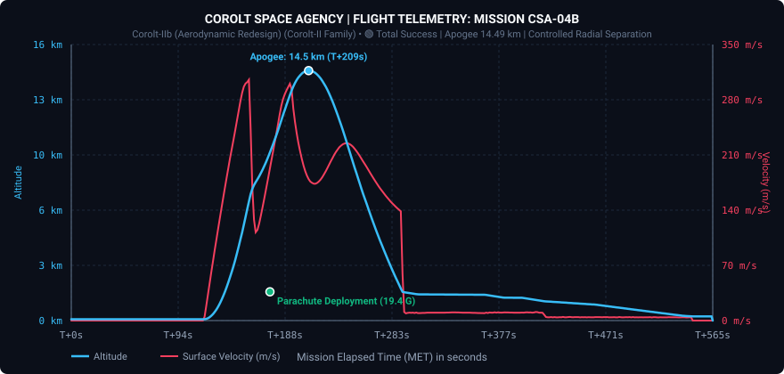
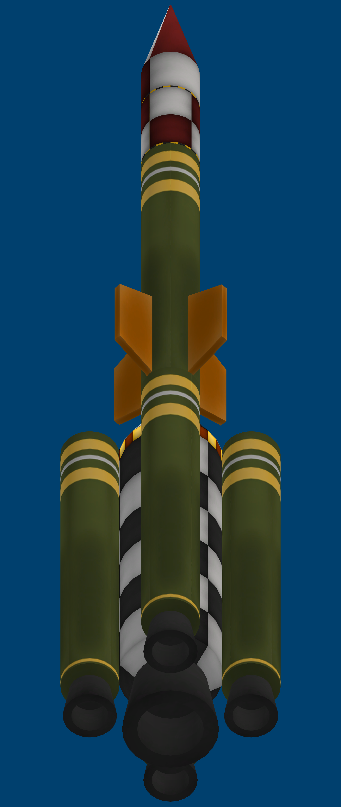

# 📋 Mission Report: CSA-04 «The Corolt-IIb Challenge»

* **Launch Date**: Year 1, Day 35 (03h 56m 39s)
* **Flight Director / Operations**: CSA Mission Control (Kerbin Launch Complex)
* **Launch Vehicle**: [Corolt-IIb (Radial Multi-Stage Variant)](/vehicles/corolt-2b)
* **Mission Status**: 🟢 RECOVERY SUCCESS AND SCIENCE RECORD (+10.4 science points)

---

## 🎯 Mission Objectives
1. **Advanced Science Suite Debut**: First flight testing and validation of the BAROTRON Barometer (`sensorBarometer`), 2HOT Thermometer (`sensorThermometer`), and meteorological suite `SRExperiment01`. *(Completed)*
2. **High-Power Propulsion & Stabilization Testing**: Assess 4 auxiliary radial booster cluster and spin stabilization dynamics. *(Completed - provided critical structural stress data)*
3. **Operational Altitude**: Escape the dense lower atmosphere and probe the middle-to-upper layers (>14 km). *(Completed - 14.49 km reached)*
4. **Intact Recovery**: Soft parachute landing and 100% instrument recovery on the grasslands of Kerbin. *(Completed)*

---

## 📊 Official Flight Telemetry (Recorded Data)

Real-time telemetry recorded via Telemachus:

| Flight Parameter | Flight Attempt 1 (CSA-04) | Definitive Flight (CSA-04b) |
| :--- | :--- | :--- |
| **Peak Altitude (Apoapsis)** | 669.7 m | **14,489.5 m (14.49 km)** |
| **Maximum Surface Speed** | 193.6 m/s (697 km/h) | **305.4 m/s (1,100 km/h)** *(at 6,897 m)* |
| **Peak Dynamic Pressure (Max Q)** | 20.354 kPa | **25,281.9 kPa** |
| **Parachute Deployment Altitude** | 156.4 m | **1,666.3 m** |
| **Peak Opening Deceleration** | 13.60 G | **19.40 G** |
| **Total Flight Duration** | 62.7 s | **447.7 seconds (7 min 28 s)** |
| **Touchdown Site** | KSC Grasslands (55.4 m) | **KSC Grasslands (1,500 m plateau)** |
| **Payload Integrity** | 100% Recovered | **100% Recovered and Intact** |

---

### Flight Telemetry Plot (CSA-04b)

*(Plot of the initial aerodynamic anomaly during CSA-04 for engineering review: [View CSA-04 Plot](../assets/csa-04_telemetry_plot.svg))*

---

## 🔬 Historic Scientific Yield (Kerbalism & R&D)

This flight established a cornerstone for CSA environmental research:
* **BAROTRON Barometer (`barometerScan@KerbinSrfLandedShores`)**: First calibrated atmospheric pressure reading on Kerbin.
* **2HOT Thermometer (`temperatureScan@KerbinSrfLandedShores`)**: First certified temperature profile.
* **Meteorological Package (`SRExperiment01@KerbinFlyingLowShores` and `SrfLanded`)**: Full recording of atmospheric boundaries.
* **Kerbalism Environmental Telemetry**: Continuous streaming over 7 minutes of descent.
* **R&D Science Haul**: Recovery yielded **+10.41 science points**, boosting agency reserves from 2.54 to **12.95 points**!

> [!NOTE]
> **Engineering Storage Diagnosis:** Standard avionics packages feature only 500 KB storage, filling up against the 3.5 MB produced by new high-rate sensors. Subsequent flights will incorporate expanded memory storage or live radio dumping.

---

## ⚠️ Structural Anomaly Analysis & Engineering Lessons

The CSA-04 flight campaign yielded major lessons in aerospace vehicle dynamics:
1. **First Attempt (CSA-04):** With an excessive liftoff TWR (>2.4) and 4 unguided radial boosters without SAS, the vehicle encountered Max Q at only 400 m, suffering aerodynamic loss of control into an unintended loop at 670 m and triggering immediate emergency parachute deployment.
2. **Definitive Flight (CSA-04b):** Thrust was throttled down and fin cant was applied to induce spin stabilization. The rotational rate was so pronounced that centrifugal forces tore the 4 radial boosters from their surface mountings at low altitude.
3. **Core Stage Behavior:** Shed of its radial boosters, the central core continued climbing vertically on rails, attaining **14,489 meters** before a smooth reentry and full payload recovery.

### Architectural Takeaway for the Corolt Program:
Radial boosters without active attitude control have been decommissioned. Future launcher evolution will center entirely around **inline (tandem)** architectures powered by heavy solid boosters (RT-10 «Hammer») in the **Corolt-III** class.

---

## 📸 Mission Vehicle Blueprint

