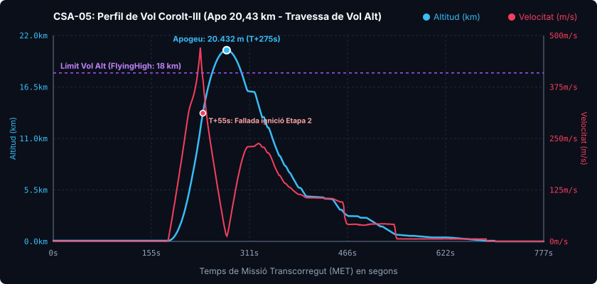

# 📋 Informe de Missió: CSA-05 «L'Estrena del Corolt-III»

* **Data del Llançament**: Any 1, Dia 45 (05h 43m 28s)
* **Operador de Vol / Comandament**: Control de Missions CSA (Cap Canaveral de Kerbin)
* **Vehicle Llançador**: [Corolt-III (Arquitectura Tàndem)](/vehicles/corolt-3)
* **Estat de la Missió**: 🟢 ÈXIT DE VOL ALT I RECUPERACIÓ ÍNTEGRA (+7,14 punts de ciència)

---

## 🎯 Objectius de la Missió
1. **Bateig Operatiu del Llançador Corolt-III**: Estrena de l'arquitectura pesada 100% en línia (tàndem) amb booster inferior RT-10 «Hammer» (1,25 m) i etapa superior SRM-XL (0,625 m). *(Assolit)*
2. **Superació de la Baixa Atmosfera**: Travessar per primer cop a la història de la CSA la frontera dels 18 km per assolir la capa de **Vol Alt (`FlyingHigh`)**. *(Assolit - 20,43 km)*
3. **Mostreig Atmosfèric Multidisciplinar**: Enregistrament simultani de pressió baromètrica, temperatura, aeronomia i condicions meteorològiques. *(Assolit)*
4. **Recuperació al KSC**: Reentrada balística estable i descens suau amb paracaigudes a les instal·lacions del Centre Espacial. *(Assolit - 100% recuperat)*

---

## 📊 Telemetria Oficial de Vol (Dades Registrades)

Dades capturades en temps real via enllaç telemètric Telemachus:

| Paràmetre de Vol | Valor Registrat CSA-05 | Estat i Observacions |
| :--- | :--- | :--- |
| **Altitud Màxima (Apoapsis)** | **20.432,3 m (20,43 km)** | 🟢 **Nou Rècord d'Altitud de la CSA** |
| **Velocitat Màxima de Superfície** | **470,9 m/s (1.695 km/h)** | 🟢 Superat Mach 1,5 en ascens net |
| **Pressió Dinàmica Màxima (Max Q)** | **29.600,6 kPa** | 🟢 Resistència estructural impecable |
| **Acceleració Màxima** | **3,10 G** | 🟢 Confort estructural òptim |
| **Desplegament del Paracaigudes** | **1.600 m (Semi) / 800 m (Plè)** | 🟢 Obertura suau i frenada controlada |
| **Velocitat de Presa de Terra** | **5,9 m/s** | 🟢 Contacte suau |
| **Durada Total de Vol** | **777,4 segons (12 min 57 s)** | 🟢 Vol complet telemetrat |
| **Lloc de Presa de Terra** | Praderies del KSC (al costat de pista) | 🟢 Recuperació immediata |

---

### Gràfica de Telemetria del Vol CSA-05

---

## 🔬 Rendiment Científic i Diagnòstic de Memòria

Malgrat una anomalia tècnica en la propulsió superior, la missió ha marcat un salt de gegant en la recerca atmosfèrica:
* **Entrada a Vol Alt (`FlyingHigh`)**: En creuar els 18.000 metres d'altitud, els sensors van registrar les primeres dades certificades de l'alta atmosfera de Kerbin.
* **Paquets de Dades Enregistrats**:
  * ⏱️ Baròmetre BAROTRON (`sensorBarometer`): 0,4 MB registrats.
  * 🌪️ Paquet Meteorològic (`SRExperiment01`): 0,6 MB registrats.
  * 🧪 Sensor d'Aeronomia (`SRExperiment02`): 0,5 MB registrats.
  * 📈 Telemetria d'Aviònica: 0,8 MB registrats.
* **Balanç d'R+D**: La recuperació íntegra de la càpsula ha sumat **+7,14 punts de ciència nets**, disparant les reserves de l'agència fins als **10,09 punts disponibles**!

> [!NOTE]
> **Diagnòstic d'Enginyeria sobre Memòria:** Les dues unitats d'aviònica de sèrie (2,00 MB cadascuna) van quedar saturades davant la quantitat massiva de dades que demana l'Aeronomia (5 MB) i el Baròmetre (3,5 MB). S'ha desplegat el pegat d'enginyeria oficial `csa_avionics.cfg` per dotar el vehicle de **32 MB de disc dur** a partir de la pròxima missió.

---

## ⚠️ Anàlisi de l'Incident de la Segona Etapa

A T+55 segons d'ascens (a 13,7 km d'altitud i 453 m/s), el sistema de telemetria va registrar l'incident:
* `[00:00:55]: Fallo de SRM-XL Sounding Rocket Motor al encender`.
* El motor sòlid SRM-XL de la 2a etapa va patir una **fallada d'ignició (*misfire*)** per fiabilitat de Kerbalism després d'haver-se separat netament del booster principal.
* **Triomf del disseny balístic:** L'impuls inicial proporcionat pel motor RT-10 «Hammer» va ser tan poderós i vertical que, per pura inèrcia balística, el vehicle va escalar fins als **20.432 metres**, completant l'objectiu d'alta atmosfera fins i tot sense la segona etapa activa.

---

## 📸 Vehicle de la Missió
* [Fitxa Tècnica Completa del Corolt-III](/vehicles/corolt-3)
