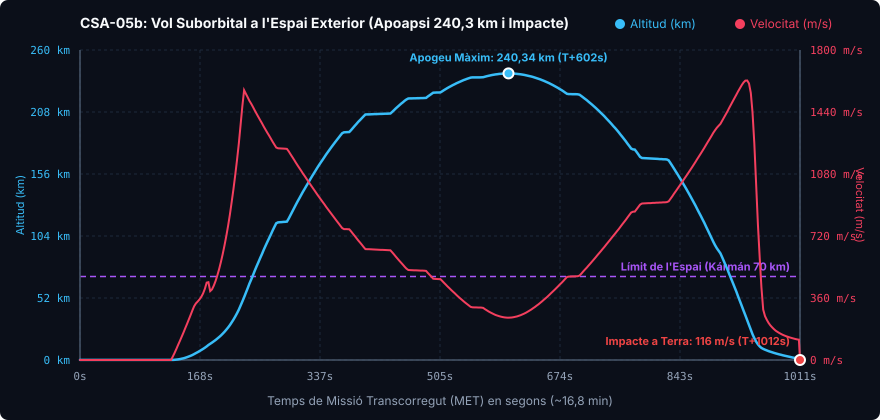

# 📋 Mission Report: CSA-05b «The Leap into Space & The CommNet Lesson»

* **Launch Date**: Year 1, Day 56 (05h 16m 15s UT 1193389)
* **Flight Director / Operations**: CSA Mission Control (Kerbin Launch Complex)
* **Launch Vehicle**: [Corolt-III (Unit 02 - Tandem)](/vehicles/corolt-3)
* **Mission Status**: 🟡 SUBORBITAL SPACE SUCCESS (240 km) | REENTRY LOSS (Ground impact due to control link loss)

---

## 🎯 Mission Objectives
1. **Cross the Frontier of Space (Kármán Line, 70 km)**: Validate Corolt-III's capability to boost payloads into outer space (`InSpaceLow`). *(Achieved — 240.34 km)*
2. **Full Tandem Two-Stage Combustion**: Verify sustained burn of the RT-10 «Hammer» (1.25 m) booster and SRM-XL (0.625 m) upper stage after the CSA-05 ignition misfire. *(Achieved — Flawless staging & ignition)*
3. **Hypersonic Aerothermal Endurance**: Monitor vehicle dynamics and dynamic pressure ($Q$) during ballistic freefall from >200 km. *(Achieved — Max Q of 52.29 kPa at Mach 5.3)*
4. **Full Payload Recovery**: Parachute deployment at safe altitude and recovery at KSC. *(Not achieved — Terrain impact)*

---

## 📊 Official Flight Telemetry (Recorded Data)

Captured in real time during flight via continuous onboard telemetry (Telemachus):

| Flight Parameter | Recorded Value CSA-05b | Status and Remarks |
| :--- | :--- | :--- |
| **Peak Altitude (Apoapsis)** | **240,336.8 m (240.34 km)** | 🟢 **All-Time CSA Spaceflight Record** |
| **Maximum Surface Speed** | **1,624.4 m/s (5,847.8 km/h)** | 🟢 Exceeded Mach 5.3 on atmospheric reentry |
| **Peak Dynamic Pressure (Max Q)** | **52,286.6 Pa (52.29 kPa)** | 🟢 Excellent aerothermal structural rigidity |
| **Maximum Acceleration** | **10.91 G** | 🟡 Severe atmospheric hypersonic deceleration |
| **Time Spent in Space (> 70 km)** | **670.8 s (11 min 11 s)** | 🟢 First prolonged stay in microgravity |
| **Parachute Deployment** | *Not executed* | 🔴 Command blocked due to lost radio uplink |
| **Impact Velocity** | **116.7 m/s (420 km/h)** | 🔴 Vehicle destroyed on collision |
| **Impact Elevation** | **896.8 m ASL** | Continental highlands east of KSC |
| **Total Recorded Flight Time** | **1,011.8 s (16 min 52 s)** | Downlink maintained until impact |

---

### Flight Telemetry Plot (CSA-05b)

---

## 🔬 Propulsion Performance Analysis

In contrast to mission CSA-05, the second Corolt-III flight stack performed nominally:
* **Stage 1 (RT-10 «Hammer»)**: Burned for 31 seconds, propelling the stack to 475 m/s at 12 km altitude.
* **Separation & Stage 2 (SRM-XL)**: High-altitude ignition was instantaneous. In the near-vacuum upper air, the motor developed its full vacuum specific impulse, driving vertical velocity to catapult apogee to **240 km**, far exceeding the 50 km baseline target.
* **Ballistic Coast**: The probe spent over 11 minutes in pure microgravity in space before beginning its atmospheric dive.

---

## ⚠️ Recovery Failure Root Cause Analysis (RCA)

At T+16 minutes, during terminal reentry:
1. **Internal Antenna Range Limit**: The `SR.ProbeCore` avionics module only featured an integrated whip antenna with **3.25 km** nominal range.
2. **Loss of CommNet Ground Link**: Far downrange from KSC and outside secondary relay station sightlines, the probe entered `No Signal` status.
3. **Command Lockout**: On uncrewed robotic probes without autonomous software, standard CommNet rules block manual stage/deployment triggers when telemetry link is severed.
4. **Fatal Sequence**: The parachute deployment command transmitted from flight control was rejected by the dead link, leading to impact at 116.7 m/s.

---

## 🛡️ Engineering Directives for Future Missions

The loss of Unit 02 yielded invaluable lessons that transformed CSA operational standards:

1. **Mandatory Surface Whip Antenna (`Communotron 16-S`)**:
   * Verified unlock of tech tree node `gptt_comm1`.
   * All future Corolt-III variants will integrate surface-mounted **Communotron 16-S** antennae, guaranteeing omnidirectional line-of-sight across Kerbin.
2. **Mechanical Parachute Pre-Arming Protocol**:
   * Recovery parachutes must be pre-armed prior to liftoff, enabling barometric pressure triggers independent of radio contact.
3. **Transition to Autonomous Flight (kOS)**:
   * Commenced engineering of onboard programmable flight software using **kOS** (`corolt3_flight.ks`), delegating staging sequences and safety chute triggers directly to the internal CPU.

---

## 📸 Mission Vehicle
* [Complete Corolt-III Technical Specifications](/vehicles/corolt-3)

