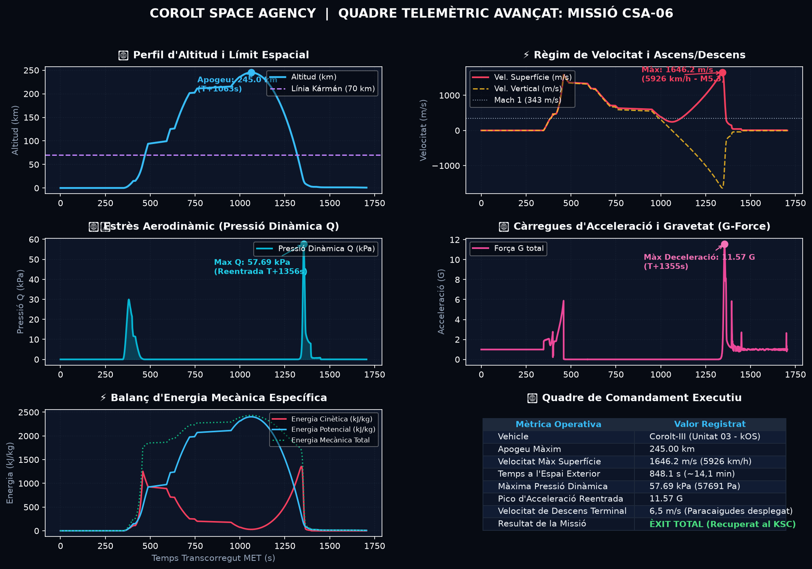
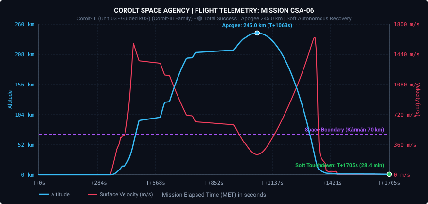

# 📋 Informe de Missió: CSA-06 «El Triomf de l'Autonomia i la Primera Recuperació Espacial»

* **Data del Llançament**: Any 1, Dia 65 (00h 30m 00s UT 1391470)
* **Operador de Vol / Comandament**: Control de Missions CSA (Cap Canaveral de Kerbin)
* **Vehicle Llançador**: [Corolt-III (Unitat 03 - Autònoma kOS)](/vehicles/corolt-3)
* **Estat de la Missió**: 🟢 ÈXIT TOTAL (Apogeu 245,0 km | Recuperació Íntegra de la Càpsula al KSC)

---

## 🎯 Objectius de la Missió
1. **Vol Suborbital a l'Espai Exterior (Línia de Kármán, 70 km)**: Superar novament la frontera de l'espai i validar la consistència del vehicle Corolt-III. *(Assolit — 245,00 km d'apogeu)*
2. **Implementació del Sistema de Vol Autònom (kOS / KerboScript)**: Eliminar la dependència del control remot terrestre (CommNet) per evitar el fatídic desenllaç del vol CSA-05b. *(Assolit — Automatització a bord operativa)*
3. **Assaig de Trajectòria Inclinada (Gravity Turn)**: Provar una inclinació inicial de 80º–82º cap a l'est (heading 90) mitjançant guiatge per programari. *(Parcial / Lliçó d'Enginyeria — Manquen superfícies de control aerodinàmic)*
4. **Recuperació Íntegra de la Càpsula Científica**: Desplegament segur del paracaigudes a velocitat subsònica i rescat de totes les dades científiques al KSC. *(Assolit — Aterratge suau a 6,5 m/s i recuperació exitosa)*

---

## 📊 Telemetria Oficial de Vol (Dades Registrades)

Dades capturades en temps real via enllaç telemètric continu de bord (Telemachus):

| Paràmetre de Vol | Valor Registrat CSA-06 | Estat i Observacions |
| :--- | :--- | :--- |
| **Altitud Màxima (Apoapsis)** | **245.005,0 m (245,00 km)** | 🟢 **Nou Rècord Absolut CSA (Espai Exterior)** |
| **Velocitat Màxima de Superfície** | **1.646,2 m/s (5.926,3 km/h)** | 🟢 Mach 5,4 en reentrada atmosfèrica |
| **Pressió Dinàmica Màxima (Max Q)** | **57.690,6 Pa (57,69 kPa)** | 🟢 Resistència estructural impecable |
| **Acceleració Màxima** | **11,57 G** | 🟡 Deceleració atmosfèrica hipersònica màxima |
| **Temps a l'Espai (> 70 km)** | **848,1 s (14 min 08 s)** | 🟢 Més de 14 minuts en microgravetat pura |
| **Desplegament del Paracaigudes** | **Executat amb Èxit** | 🟢 Obertura completada a ~1.600 m d'altitud |
| **Velocitat de Descenso Terminal** | **6,5 m/s (23,4 km/h)** | 🟢 Descens ultra-estable sota campana |
| **Velocitat de Toc a Terra** | **~0,0 m/s** | 🟢 Aterratge suau sense cap dany estructural |
| **Cota d'Aterratge** | **897,6 m s.n.m.** | Terreny continental a l'est del KSC |
| **Durada Total de Vol** | **1.705,0 s (28 min 25 s)** | Missió completa enregistrada íntegrament |

---

### Quadre de Comandament i Anàlisi Multivariable (CSA-06)

### Gràfica Interactiva SVG de Telemetria Bàsica

---

## 🔬 Anàlisi del Guiatge i Rendiment de Propulsió

### 1. El Guiatge kOS en Acció
Per primera vegada en la història de l'agència, el coet portava un ordinador de bord programable amb **KerboScript**. El script `corolt3_guided_ascent.ks` va gestionar:
* El compte enrere i ignició de la primera etapa (RT-10 «Hammer»).
* L'encesa de la segona etapa (SRM-XL) en esgotar-se el booster.
* La intenció de maniobra de cabeceig (*pitch kick*) per començar a planar cap a l'òrbita.

### 2. La Lliçó de l'Autoritat de Control Aerodinàmic
Tot i que el programari va enviar l'ordre de girar a 82º d'inclinació cap a l'est, el coet va continuar pujant pràcticament en vertical:
* **Motors sòlids sense tovera mòbil**: Ni el Hammer ni el SRM-XL tenen orientació d'empenta (*gimbal*).
* **Alerons passius fixes**: Els alerons `SR.Wing.01` i `02` muntats són plans i actuen com les plomes d'una fletxa, estabilitzant el coet fermament cap a la trajectòria prograde i resistint qualsevol canvi de rumb.
* **Sense parell de gir suficient**: Els petits volants d'inèrcia de la sonda robòtica no tenen prou força contra les forces aerodinàmiques de la fase d'ascens.

---

## 🪂 L'Èxit de la Recuperació: La Venjança de la CSA-05b

A diferència de la tràgica missió anterior, on el bloqueig de CommNet va impedir salvar la càpsula:
1. La nau va sobreviure a una reentrada a Mach 5,4 i 11,5 G de deceleració aerodinàmica.
2. En assolir velocitat subsònica i altitud segura, el sistema de paracaigudes es va activar correctament.
3. La velocitat es va frenar dràsticament de més de 40 m/s a només **6,5 m/s**.
4. La càpsula va fer un aterratge de llibre a les planícies de Kerbin i va ser recuperada intacta amb **totes les mostres científiques de l'espai exterior**.

---

## 🛡️ Decisions d'Enginyeria per a la Missió CSA-07

1. **Desbloqueig Tecnològic a R&D**:
   * Desbloquejar `Powered Flight` (1 ciència) i `Airframe Construction` (10 ciència) per obtenir els alerons de control actiu **AV-R8 Winglet** (`R8winglet`) i **Delta-Deluxe** (`winglet3`).
2. **Actualització del Vehicle Corolt-III**:
   * Substituir els alerons inferiors passius per superfícies de control mòbils. Això atorgarà a kOS el parell aerodinàmic necessari per desviar la trajectòria i fer un autèntic *Gravity Turn*.
3. **Ejecció de Carenats/Cobertes**:
   * Incorporar la seqüència de desacoblament de la coberta del truss a més de 60 km d'altitud per alliberar la nau per a la fase orbital.
