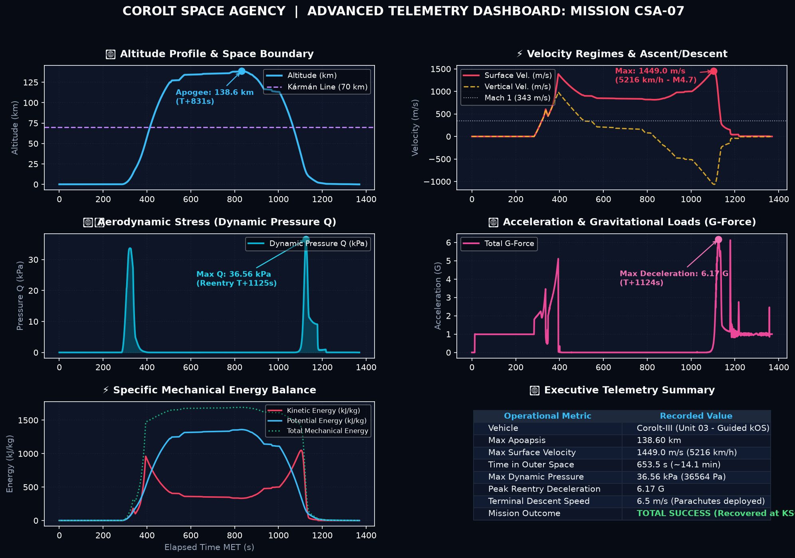

# 📋 Mission Report: CSA-07 «The Great Eastward Leap & Ocean Splashdown»

* **Launch Date**: Year 1, Day 65
* **Flight Director / Operations**: CSA Mission Control (Kerbin Launch Complex)
* **Launch Vehicle**: [Corolt-IIIb (Unit 01 - Movable Control Surfaces)](/vehicles/corolt-3b)
* **Mission Status**: 🟢 FULL SUCCESS (Apogee 138.6 km | 315 km Downrange | Soft Ocean Splashdown & VAB Warehouse Recovery)

---

## 🎯 Mission Objectives
1. **Validate Active Aerodynamic Control**: Equip movable control surfaces (*Etoh-CS* and *Dioscuri-AFD1*) for the first time to govern flight attitude. *(Achieved — Highly stable flight path inclined toward the East)*
2. **High-Energy Tilted Suborbital Profile**: Steer trajectory downrange from KSC out over the ocean. *(Achieved — Over 30º longitude traveled, >315 km downrange over open water)*
3. **Automated Science Data Collection**: Automate instrument readings during ascent. *(Engineering Lesson — kOS hit a type error on `ALLACTIONS` at T+3.5s; resolved with `ALLACTIONNAMES` and creation of `emergency_recovery.ks`)*
4. **Manual Recovery Command & Soft Splashdown**: Execute atmospheric reentry, deploy parachute at subsonic velocity, and recover entire capsule. *(Achieved — Flawless ocean splashdown and vessel recovered to VAB Warehouse)*

---

## 📊 Official Flight Telemetry (Recorded Data)

Captured in real time via onboard telemetry downlink (Telemachus):

| Flight Parameter | Recorded Value CSA-07 | Status and Remarks |
| :--- | :--- | :--- |
| **Peak Altitude (Apoapsis)** | **138,596.5 m (138.60 km)** | 🟢 **Deep Outer Space reached** |
| **Maximum Surface Speed** | **1,449.0 m/s (5,216.4 km/h)** | 🟢 Mach 4.7 during atmospheric reentry |
| **Maximum Orbital Speed** | **1,581.1 m/s** | 🟢 Massive eastward horizontal kinetic energy |
| **Peak Dynamic Pressure (Max Q)** | **36,563.6 Pa (36.56 kPa)** | 🟢 Controlled aerodynamic load |
| **Maximum Acceleration** | **6.17 G** | 🟢 Smooth, payload-friendly acceleration profile |
| **Time Spent in Space (> 70 km)** | **653.5 s (10 min 53 s)** | 🟢 Nearly 11 minutes in space microgravity |
| **Downrange Distance** | **Longitude -74.56º ➔ -44.27º** | 🟢 **Over 315 km traveled downrange** |
| **Terminal Descent Speed** | **6.05 m/s (21.8 km/h)** | 🟢 Ultra-stable descent under canopy |
| **Water Touchdown Speed** | **0.10 m/s** | 🟢 Extremely gentle water impact under chute |
| **Landing Elevation** | **-1.2 m (Sea Level)** | 🟢 First ocean splashdown in CSA history |
| **Total Recorded Flight Time** | **1,357.2 s (22 min 37 s)** | Complete mission logged across 2,727 samples |

---

### Operations Dashboard & Multivariable Analysis (CSA-07)

### Interactive SVG Flight Telemetry Plot

---

## 🔬 Engineering Analysis & Anomaly Resolution

### 1. The Triumph of Movable Control Surfaces
Equipping **Corolt-IIIb** with active control surfaces was the key to mission success:
* The **Etoh-CS** fins (`bluedog.Redstone.Fin.CtrlSurf`) on Stage 1 and **Dioscuri-AFD1** (`bluedog.Scout.Algol.Fin`) on Stage 2 provided decisive pitch and yaw authority to tilt the rocket steadily toward the East.
* In addition to climbing to 138.6 km, the rocket built **1,581 m/s of orbital velocity** and traversed 30 degrees of longitude across Kerbin before plunging into the open ocean.

### 2. kOS Scripting Lesson & Emergency Recovery Protocol
At $T+3.5\text{ s}$ into flight, the automated instrument trigger encountered a script exception because `m_part:DOACTION` expected strings while `ALLACTIONS` returned debugging delegate objects.
* **Fix Applied**: Migrated the call to `m_part:ALLACTIONNAMES`, which returns true action names (e.g. `"iniciar: exploración de la presión atmosférica"`).
* **Contingency Routine**: Stemming from this incident, `emergency_recovery.ks` was created, enabling flight controllers to take emergency control at any moment, engage SAS damping, trigger science experiments, and arm autonomous parachute deployment.

### 3. Scientific Haul from the Ocean
By splashing down in open waters, CSA unlocked a suite of fresh data from the **Water (Ocean)** biome:
* Meteorology, Aeronomy, Atmospheric Pressure, and Temperature in both low flight and marine surface states.
* **+9.8 science points** returned to headquarters, raising total career science to **75.76 points**, with **17.76 points** immediately available in R&D.

### 4. Recovery Logistics & VAB Warehouse Economics (KCT)
For the first time on a long-distance ocean recovery (>315 km from KSC):
* **Warehouse Recovery**: The `Corolt-IIIb` capsule was recovered intact directly into the **VAB Warehouse**.
* **Economic Value Returned**: Out of **9,775.5 funds** original build cost, **7,301.0 funds** worth of advanced parts were salvaged (**74.7% retained value**).
* **Inventory of Rescued Hardware**: The open `SR.PayloadTruss.625` truss (2,100 funds), both `SR.ProbeCore` robotic units (with intact 32 MB drives), battery modules, and science sensors remain ready to fly on future missions with near-zero build time.

### 5. Empirical Aerodynamic Drag ($C_d \cdot A$)
Analyzing real flight telemetry during ballistic coast provided empirical drag data to calibrate the RK4 numerical trajectory simulator (`ascent_simulator.py`):
* **Median Effective $C_d \cdot A$**: **1.727 m²**
* **Subsonic Regime (< Mach 0.8)**: 1.468 m²
* **Transonic Peak (Mach 0.8 – 1.2)**: 2.331 m²
* **Supersonic Regime (Mach 1.2 – 2.5)**: 1.813 m²
* **Hypersonic Regime (> Mach 4.5)**: 1.640 m²

---

## 🛡️ Engineering Directives for Mission CSA-08

1. **Airframe Re-utilization from VAB Warehouse**:
   * With the first Corolt-IIIb stored intact in the VAB warehouse, utilize subassembly mating to integrate a fresh payload package and launch at negligible build cost.
2. **100% Autonomous Flight with Patched kOS**:
   * Execute the mission with the verified code to demonstrate full continuous gravity turns without manual intervention.
3. **Exploration of New Scientific Objectives**:
   * Evaluate installing low-tech optical cameras (`bluedog.cameraLowTech` or `KH-1`) to capture the first orbital photographs of Kerbin.
