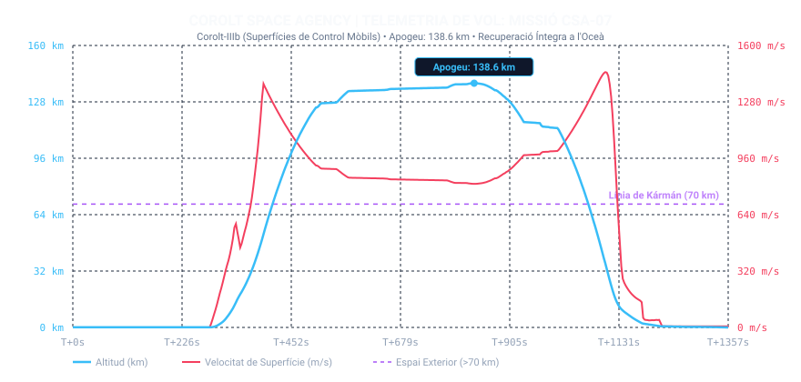

# 📋 Informe de Missió: CSA-07 «El Gran Salt a l'Est i el Bateig Oceànic»

* **Data del Llançament**: Any 1, Dia 65
* **Operador de Vol / Comandament**: Control de Missions CSA (Cap Canaveral de Kerbin)
* **Vehicle Llançador**: [Corolt-IIIb (Unitat 01 - Superfícies Mòbils)](/vehicles/corolt-3)
* **Estat de la Missió**: 🟢 ÈXIT TOTAL (Apogeu 138,6 km | 315 km Downrange | Amaratge Suau i Recuperació al VAB)

---

## 🎯 Objectius de la Missió
1. **Validació d'Autoritat de Control Actiu**: Equipar alerons mòbils (*Etoh-CS* i *Dioscuri-AFD1*) per primera vegada per governar l'actitud de vol. *(Assolit — Trajectòria orientada amb gran estabilitat cap a l'Est)*
2. **Vol Suborbital Inclinat d'Alta Energia**: Desviar la trajectòria des del KSC mar endins per assolir distància horitzontal significativa (*downrange*). *(Assolit — Més de 30º de longitud recorreguts, >315 km sobre l'oceà)*
3. **Automatització de Sensors Científics**: Iniciar la recollida d'experiments a l'ascens. *(Lliçó d'Enginyeria — El programa kOS va topar amb un error de tipus a `ALLACTIONS` a T+3,5s; resolt amb `ALLACTIONNAMES` i creació del protocol `emergency_recovery.ks`)*
4. **Rescat Manual i Amaratge Suau**: Executar la reentrada atmosfèrica, desplegar paracaigudes a velocitat subsònica i recuperar íntegrament la nau. *(Assolit — Amaratge impecable a l'aigua i nau retornada al VAB Warehouse)*

---

## 📊 Telemetria Oficial de Vol (Dades Registrades)

Dades capturades en temps real via l'enllaç telemètric continu de bord (Telemachus):

| Paràmetre de Vol | Valor Registrat CSA-07 | Estat i Observacions |
| :--- | :--- | :--- |
| **Altitud Màxima (Apoapsis)** | **138.596,5 m (138,60 km)** | 🟢 **Espai Exterior profund assolit** |
| **Velocitat Màxima de Superfície** | **1.449,0 m/s (5.216,4 km/h)** | 🟢 Mach 4,7 en descens atmosfèric |
| **Velocitat Màxima Orbital** | **1.581,1 m/s** | 🟢 Impuls cinètic horitzontal massiu cap a l'Est |
| **Pressió Dinàmica Màxima (Max Q)** | **36.563,6 Pa (36,56 kPa)** | 🟢 Càrrega estructural aerodinàmica controlada |
| **Acceleració Màxima** | **6,17 G** | 🟢 Perfil suau i confortable per a la càrrega útil |
| **Temps a l'Espai (> 70 km)** | **653,5 s (10 min 53 s)** | 🟢 Gairebé 11 minuts en microgravetat espacial |
| **Abast Horitzontal (Downrange)** | **Longitud -74,56º ➔ -44,27º** | 🟢 **Més de 315 km recorreguts sobre l'oceà** |
| **Velocitat de Toc a l'Aigua** | **0,10 m/s** | 🟢 Amaratge ultra-suau sota paracaigudes |
| **Cota d'Aterratge / Amaratge** | **-1,2 m (Nivell del Mar)** | 🟢 Primer amaratge oceànic de la història de la CSA |
| **Durada Total de Vol** | **1.357,2 s (22 min 37 s)** | Missió completa enregistrada en 2.727 mostres |

---

### Gràfica Interactiva SVG de Telemetria de Vol

---

## 🔬 Anàlisi d'Enginyeria i Resolució d'Anomalies

### 1. El Triomf dels Alerons Mòbils
La decisió d'equipar el **Corolt-IIIb** amb superfícies de control actiu ha estat la clau de l'èxit:
* Els alerons **Etoh-CS** (`bluedog.Redstone.Fin.CtrlSurf`) a la primera etapa i **Dioscuri-AFD1** (`bluedog.Scout.Algol.Fin`) a la segona etapa han atorgat un parell de cabeceig i guinyada que ha permès inclinar el coet amb decisió cap a l'Est.
* El coet no només ha pujat a l'espai (138,6 km), sinó que ha desenvolupat **1.581 m/s de velocitat orbital** i ha creuat 30 graus de planeta, caient en ple oceà obert.

### 2. Lliçó de Programari kOS i Protocol d'Emergència
A $T+3,5\text{ s}$ de vol, la rutina d'activació d'experiments va patir una excepció perquè el mètode `m_part:DOACTION` requeria cadenes de text i `ALLACTIONS` retornava objectes delegats de depuració.
* **Correcció Aplicada**: Es va migrar la crida a `m_part:ALLACTIONNAMES`, que retorna els noms reals de les accions (ex: `"iniciar: exploración de la presión atmosférica"`).
* **Protocol de Salvament**: Arran d'aquest incident, es va redactar el nou script `emergency_recovery.ks` que permet prendre el control d'emergència en qualsevol moment, estabilitzar la nau en SAS, activar la ciència i gestionar el desplegament autònom de paracaigudes.

### 3. El Botí Científic de l'Oceà
En caure en aigües obertes, la CSA ha desbloquejat per primera vegada un reguitzell de dades científiques del bioma **Agua / Oceà**:
* Meteorologia, Aeronomia, Pressió Atmosfèrica i Temperatura en vol baix i superfície marina.
* **+9,8 punts de ciència** afegits a la seu central, elevant el compte a **75,76 punts** llestos per a noves investigacions a R&D.

---

## 🛡️ Decisions d'Enginyeria per a la Missió CSA-08

1. **Reutilització del Vector al VAB Warehouse**:
   * Com que el primer Corolt-IIIb ha estat recuperat íntegre al magatzem del VAB, podem emprar la metodologia de subconjunts (*Subassemblies*) per acoblar-hi una nova càrrega científica i llançar-lo amb un cost de fabricació quasi nul.
2. **Vol 100% Autònom amb kOS Corregit**:
   * Executar la missió amb el codi ja verificat per comprovar el gir gravitatori continu complet sense intervenció manual.
3. **Exploració de Nous Objectius Científics**:
   * Valorar la instal·lació de càmeres fotogràfiques de baixa tecnologia (`bluedog.cameraLowTech` o `KH-1`) per a enregistrar les primeres imatges orbitals de Kerbin.
