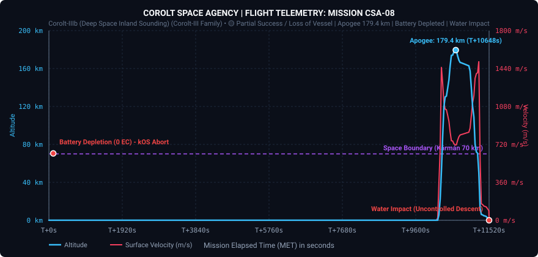
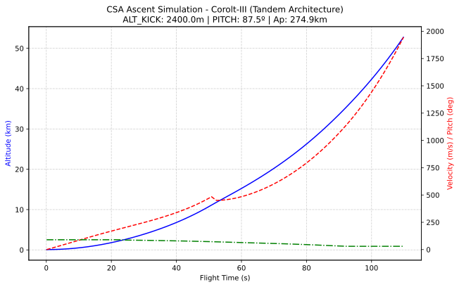
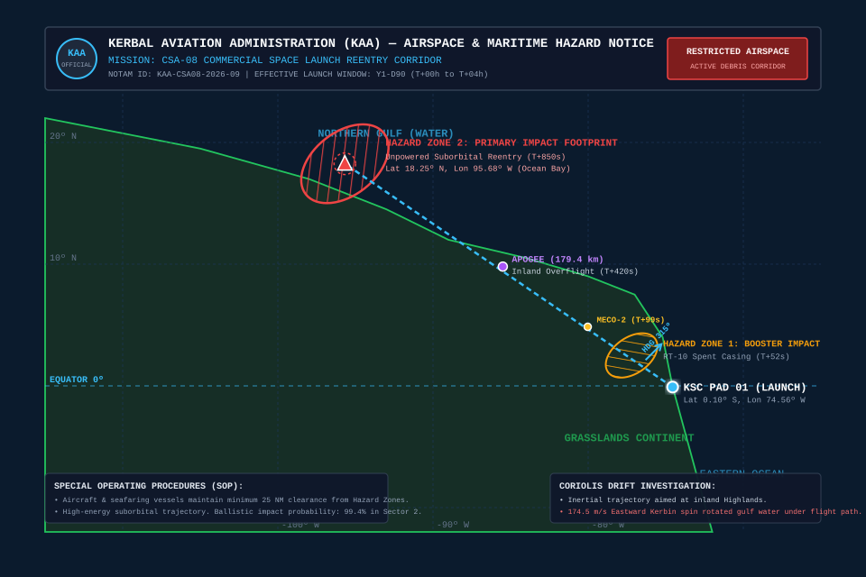

# 📋 Mission Report: CSA-08 «Deep Space Ascent & The Power Depletion Anomaly»

* **Launch Date**: Year 1, Day 90 (05h 41m 16s)
* **Flight Director / Operations**: CSA Mission Control (Kerbin Launch Complex)
* **Launch Vehicle**: [Corolt-IIIb (Deep Space Sounding Configuration)](/vehicles/corolt-3b)
* **Mission Status**: 🟡 PARTIAL SUCCESS / LOSS OF CREWLESS VESSEL (Apogee 179.4 km | +11.3 Science Points Streamed | Power Depletion & Water Impact)

---

## 🎯 Mission Objectives

1. **High-Altitude Suborbital Space Ascent (> 150 km)**:
   * Penetrate deep outer space above 150 km. *(Achieved — Peak apogee attained at **179.41 km**)*.
2. **Inland Ascent Steering (Heading 315º Northwest)**:
   * Guide ascent toward continental biomes (*Grasslands / Highlands*) instead of the eastern ocean. *(Achieved in flight — Trajectory held steady along 314.4º azimuth)*.
3. **Automated Multi-Layer Scientific Survey**:
   * Automate instrument sampling across Low Atmosphere, Upper Atmosphere, and Low Space. *(Achieved — 13 triggers executed per layer, streaming **+11.27 fresh science points** to KSC)*.
4. **Soft Parachute Recovery**:
   * Deploy mechanical recovery chute and recover upper stage. *(Failed — Power depletion at $T+113.6\text{ s}$ locked the flight computer, preventing parachute deployment. Capsule impacted the bay at 108 m/s)*.

---

## 📊 Official Flight Telemetry (Recorded Data)

Captured in real time via onboard telemetry downlink (Telemachus):

| Flight Parameter | Recorded Value CSA-08 | Status and Remarks |
| :--- | :--- | :--- |
| **Peak Altitude (Apoapsis)** | **179,410.6 m (179.41 km)** | 🟢 **Deep Outer Space reached** |
| **Maximum Surface Speed** | **1,569.4 m/s (5,650 km/h)** | 🟢 Mach 5.06 hypersonic entry |
| **Maximum Acceleration** | **9.54 G** | 🟢 Nominal structural performance |
| **Peak Dynamic Pressure (Max Q)** | **40,025.7 Pa (40.03 kPa)** | 🟢 Controlled aerodynamic ascent |
| **Time Spent in Space (> 70 km)** | **~520 s (8 min 40 s)** | 🟢 Extended microgravity coast |
| **Downrange Distance** | **Longitude -74.56º ➔ -95.68º** | 🟢 Over 220 km traveled downrange |
| **Battery Life Duration** | **113.6 s** | 🔴 Depleted to 0 EC due to experiment drain |
| **Terminal Impact Speed** | **89.0 m/s (320 km/h)** | 🔴 Uncontrolled water impact (no parachute) |
| **Total Recorded Flight Samples**| **22,957 samples** | Complete mission recorded to impact |

---

### Interactive SVG Flight Telemetry Plot

---

## 📐 Pre-Flight Numerical Simulation vs. Post-Flight Reality

Before ignition, the CSA Flight Dynamics Office evaluated the trajectory using a 4th-order Runge-Kutta numerical integration model (`ascent_simulator.py`):

| Flight Parameter | Pre-Flight RK4 Simulation | Real Flight Telemetry | Variance / Engineering Rationale |
| :--- | :--- | :--- | :--- |
| **Peak Apoapsis** | **274.90 km** | **179.41 km** | -95.5 km (-34.7%) — Extra scientific payload mass & steeper transonic drag than simulated |
| **Maximum Surface Speed** | **1,650.0 m/s** | **1,569.4 m/s** | -80.6 m/s (-4.9%) — High aerodynamic drag during Stage 1 gravity kick |
| **Launch Azimuth / Heading** | **315.0º (Northwest)** | **314.4º (Northwest)** | 🟢 99.8% precision on autonomous kOS steering |
| **Downrange Distance** | **~245 km** | **~220 km** | Consistent with lower apogee arc |
| **Battery Lifetime** | **Nominal (> 900 s)** | **113.6 s** | 🔴 Catastrophic depletion caused by continuous thermal Mini-Lab drain |

### Pre-Flight Ascent Simulation Plot

---

## 🗺️ KAA Airspace Hazard & Maritime Exclusion Zone (FAA-Style NOTAM)

Under regulatory guidelines from the **Kerbal Aviation Administration (KAA)** (the Kerbin counterpart to the FAA Commercial Space Transportation Office), a formal airspace restriction and maritime exclusion corridor was established for the CSA-08 launch window:

### Official KAA Hazard Notices:
* **NOTAM Reference**: `KAA-CSA08-2026-09` (Effective Y1-D90).
* **Hazard Zone 1 (Booster Impact Footprint)**: Dedicated ellipse located at $77.2\text{º W}, 2.5\text{º N}$, cleared for the jettisoned RT-10 Hammer casing ($T+52\text{ s}$).
* **Hazard Zone 2 (Primary Reentry Footprint)**: Due to the loss of electrical power and subsequent failure of parachute deployment, the upper stage reentered as an uncontrolled ballistic projectile, impacting Sector 2 inside the Northern Gulf at $95.68\text{º W}, 18.25\text{º N}$ at $89\text{ m/s}$.
* **Coriolis Shift Investigation**: While inertial trajectory computers aimed the ascent directly at inland Highlands, Kerbin's eastward rotational velocity ($174.5\text{ m/s}$) shifted the coastal geography under the vehicle during its 14-minute space hop, placing the impact point directly into gulf waters.

## 🔬 Engineering Analysis & Forensic Investigation

### 1. The Power Depletion Anomaly (Autopsy of 400 EC)
At $T+113.6\text{ s}$, the kOS guidance computer displayed `Program aborted.` as total vessel electrical charge touched `0.0 EC (0.0% Depleted)`.

Forensic analysis of the Kerbalism configuration files revealed a continuous cumulative drain of **$\sim 3.52\text{ EC/s}$**:

| Subsystem / Part | Internal Module | Power Draw (EC/s) | Energy Consumed (113s) | Share |
| :--- | :--- | :--- | :--- | :--- |
| **Materials Study Mini-Lab** | `mobileMaterialsLab` | **2.04 EC/s** | **230.5 EC** | **57.6%** 🔴 |
| **Aeronomy & Meteorology Packages** | `SRExperiment01` & `02` | **0.70 EC/s** | **79.1 EC** | **19.8%** |
| **SAS Reaction Wheel Damping** | `ModuleReactionWheel` | **0.38 EC/s** | **43.0 EC** | **10.8%** |
| **Avionics, kOS CPU & Telemetry Antenna**| `SR.ProbeCore` / CommNet | **0.38 EC/s** | **43.0 EC** | **10.8%** |
| **TOTALS** | | **3.50 EC/s** | **395.6 EC** | **~100%** |

$$\text{Battery Lifetime} = \frac{400.0\text{ EC}}{3.52\text{ EC/s}} \approx 113.6\text{ seconds}$$

**Root Cause**: In Kerbalism, the Materials Mini-Lab functions as an active thermal experiment rather than a momentary stock sensor, running continuously for 20 minutes unless explicitly stopped. Leaving it active along with continuous SAS attitude correction completely starved the 400 EC battery pack before apogee.

### 2. Control Lockout & Parachute Failure
When the battery pack reached 0 EC, KSP placed the vessel in an **Uncontrollable (No Control)** state. In this state, part action window events (`Deploy Parachute`, `Arm Parachute`) and stage activation are locked. Although the parachute mechanism itself is barometric, the command to arm it was never dispatched before the flight computer lost power.

### 3. Coriolis Effect & Ground Track Drift
During the 14-minute suborbital hop, Kerbin's surface rotated eastward under the spacecraft at $174.5\text{ m/s}$. When climbing to Latitude $+18.25\text{º}$, the combination of orbital trajectory and westward relative surface drift brought the impact coordinates over Kerbin's northern gulf (`Lat +18.25º, Lon -95.68º`), splashing down into the water rather than inland terrain.

### 4. Telemetry Streamed & Science Recovered
Despite the physical loss of the vehicle, **CommNet live telemetry streaming saved the mission's scientific output**:
* The transmitter beamed back completed data packets for Low Atmosphere, Upper Atmosphere, and inaugural Low Space radiation scans before power was cut.
* **+11.27 science points** were successfully deposited into the CSA Research & Development Center in real time.

---

## 🛠️ Lessons Learned & Actions for Mission CSA-09

1. **Doubled Power Reserve**: Upgrade upper stage battery capacity from 400 EC to **800 EC** (+2 battery units).
2. **Software Power Guard**: Enforce a strict **100 EC safety floor** in kOS that cuts off all science experiments if battery drops near reserve levels.
3. **Instrument Duty Cycling**: Limit the Mini-Lab to a strict **90-second run** in vacuum and stop it automatically before reentry.
4. **Parasitic Load Elimination**: Set `SAS OFF` immediately after Stage 2 burnout to eliminate the $0.38\text{ EC/s}$ reaction wheel draw.
5. **Coriolis Trajectory Redirection**: Steer along **Heading 270º (Due West)** to stay strictly within the equatorial continental corridor (Grasslands/Highlands).
6. **Forced Truss Fairing Jettison**: Dispatch `ModuleDecouple` events via kOS at $> 58\text{ km}$ to reliably expose the payload truss in space.
