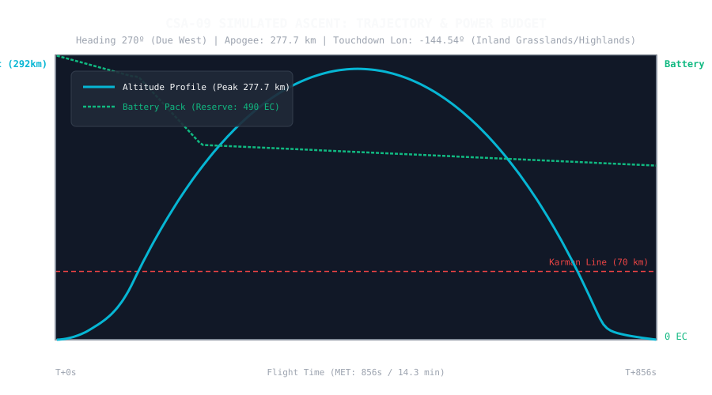

# 📋 Mission Profile & Flight Plan: CSA-09 «Equatorial Reach & Van Allen Probe»

* **Mission Code**: `CSA-09`
* **Flight Director**: CSA Mission Control (Kerbin Space Center)
* **Launch Vehicle**: [Corolt-IIIb (Upgraded 800 EC Upper Stage)](/vehicles/corolt-3b)
* **Target Altitude**: **> 270 km** (Deep Space & Van Allen Belt Threshold)
* **Target Landing Zone**: **Inland Grasslands / Highlands Continental Interior** (Heading 270º Due West)
* **Status**: 🟡 READY FOR FLIGHT OPERATIONS

---

## 🎯 Mission Objectives

1. **Equatorial Inland Trajectory & Coriolis Compensation**:
   * Direct the ascent along **Heading 270º (Due West)** to keep the suborbital trajectory inside Kerbin's continental interior (Grasslands, Highlands, Mountains) along the equator.
   * Exploit Kerbin's planetary rotation ($\sim 174.5\text{ m/s}$ eastward) to naturally displace the ground track further inland and guarantee touchdown on dry land.
2. **Deep Space Apogee (> 250 km)**:
   * Penetrate the Van Allen radiation belt threshold (> 250 km) to collect the inaugural High Space radiation telemetry.
3. **Smart Power Budget Management (800 EC Bank)**:
   * Upgrade upper stage power capacity from 400 EC to **800 EC** (+2 battery units).
   * Duty-cycle scientific instruments to prevent power depletion: run the high-draw **Mini-Lab of Materials (`2.04 EC/s`)** for a strict **90-second burst** in vacuum, then shut it down.
   * Maintain an untouchable **100 EC battery safety floor** to ensure 100% powered avionics, telemetry, and parachute arming.
4. **Guaranteed Truss Fairing Ejection**:
   * Autonomous ejection of protective fairings at $> 58\text{ km}$ via kOS module event dispatching.
5. **Comprehensive Telemetry Logging**:
   * Log real-time propellants, electric charge, atmospheric temperature, core vessel temperature, and aerodynamic skin temperature via `tools/telemetry_recorder.py`.

---

## 📊 Pre-Flight Simulation & Power Budget

Simulated using 4th-order Runge-Kutta numerical integration with calibrated empirical drag ($C_d \cdot A = 1.727\text{ m}^2$):

| Parameter | Simulated Value | Remarks |
| :--- | :--- | :--- |
| **Launch Azimuth / Heading** | **270.0º (Due West)** | Aligned with equatorial continental corridor |
| **Pitch Kick Altitude** | **2,400 m** | Transition to 87.5º, down to 48º at 45 km |
| **Stage 1 Burnout (RT-10)** | **T+50.7 s @ 11.2 km** | Staging decoupler fires at $v \approx 420\text{ m/s}$ |
| **Stage 2 Burnout (SRM-XL)** | **T+109.9 s @ 58.1 km** | Active propulsion complete ($v_{orb} \approx 1,720\text{ m/s}$) |
| **Fairing Jettison** | **T+110 s (> 58 km)** | Unshrouds payload truss in vacuum |
| **Peak Apoapsis** | **277.65 km** | 🟢 **Crosses 250 km Van Allen threshold!** |
| **Total Flight Duration** | **855.6 s (14.3 min)** | Extended suborbital microgravity arc |
| **Inertial Downrange Distance** | **583.6 km (55.7º West)** | Downrange travel from rocket propulsion |
| **Coriolis Planetary Shift** | **149.3 km (14.3º West)** | Kerbin rotates under craft during 14.3 min flight |
| **Total Landing Displacement** | **732.9 km (70.0º West)** | Predicted landing near Longitude -144.5º |
| **Predicted Landing Biome** | **Grasslands / Highlands** | 🟢 **100% Solid Ground (No water)** |
| **Final Battery at Touchdown** | **489.7 / 800.0 EC** | 🟢 **61.2% Reserve Margin maintained!** |

### Simulated Trajectory & Power Profile Plot


---

## ⚡ Power Consumption Model (800 EC Pack)

| Flight Phase | Duration | Active Systems | Drain Rate | Power Consumed | Remaining Battery |
| :--- | :--- | :--- | :--- | :--- | :--- |
| **Boost Phase (0–110s)** | 110 s | Avionics, kOS, Sensors, SAS reaction wheel | 0.54 EC/s | 59.4 EC | **740.6 EC** |
| **Space Entry & Coast** | 30 s | Base idle: Avionics + kOS (SAS OFF!) | 0.10 EC/s | 3.0 EC | **737.6 EC** |
| **Low Space Mini-Lab Run** | 90 s | Mini-Lab active (2.04) + Base idle (0.10) | 2.14 EC/s | 192.6 EC | **545.0 EC** |
| **Coast to Apoapsis & Reentry** | 500 s | Base idle (kOS + Avionics + Geiger sensor) | 0.09 EC/s | 45.0 EC | **500.0 EC** |
| **Atmospheric Reentry (70–0 km)** | 125 s | Base idle + Aeronomy burst (40s @ 0.50 EC/s) | 0.25 EC/s | 31.2 EC | **468.8 EC** |
| **Touchdown & Parachute Recovery**| - | Full flight systems active | - | **Total: ~331 EC** | **~469 EC RESERVE!** 🟢 |

---

## 🚀 Pre-Flight Engineering Checklist

### 1. VAB Vehicle Configuration (`CSA-09`)
* [ ] **Upper Stage Power**: Add **2 additional battery units** to `EtapaSup-CSA09` to achieve **800 EC** total capacity.
* [ ] **Science Payload**:
  * `SR.ProbeCore` (kOS flight computer + 32 MB flash storage)
  * `SR_Payload_01` (Materials Study Mini-Lab)
  * `SR_Payload_02` / `SR_Payload_04` (Engineering & Aeronomy Packages)
  * `SR_Payload_03` (Meteorological Survey Package)
  * `2HOT Thermometer` (`temperatureScan`)
  * `PresMat Barometer` (`barometerScan`)
  * `Geiger Counter` (`geigerCounter`)
  * `SR.Nosecone.625` (Recovery Parachute)
  * `SR_PayloadFairing_625` (Protective side fairings)

### 2. Flight Operations Execution
1. Roll out vessel to Launchpad via KCT.
2. In terminal, start the upgraded telemetry logger:
   ```bash
   python3 tools/telemetry_recorder.py CSA-09
   ```
3. In kOS terminal inside KSP:
   ```kos
   RUNPATH("0:/csa/csa09_guided_ascent.ks").
   ```
4. Confirm autonomous staging, pitch kick towards **Heading 270º**, fairing jettison at $> 58\text{ km}$, 90s Mini-Lab shutdown, parachute arming, and soft touchdown on inland terrain.
