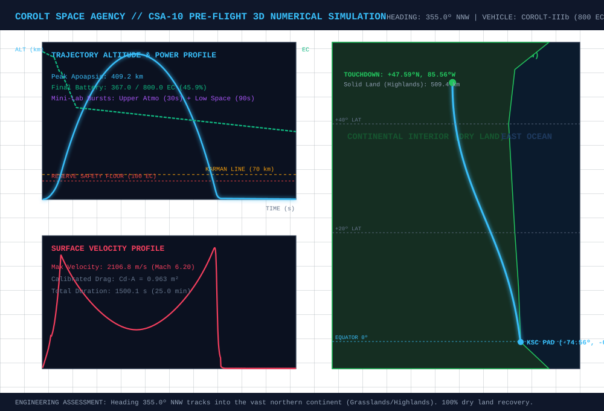
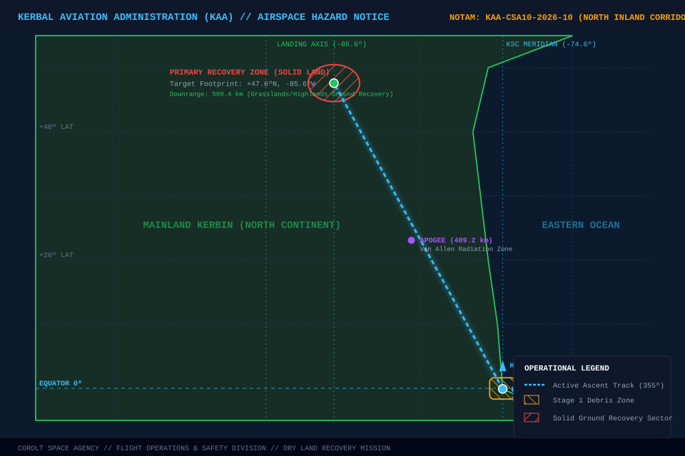
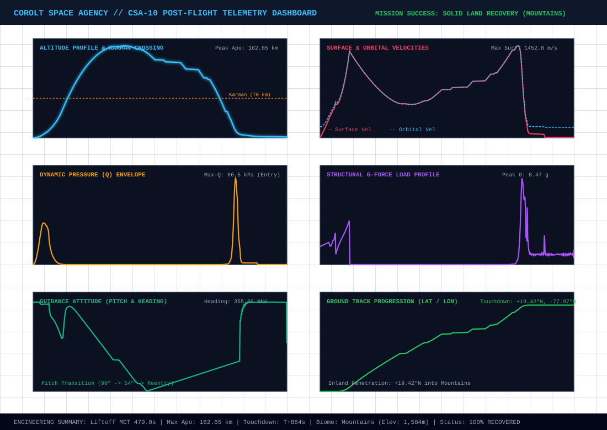
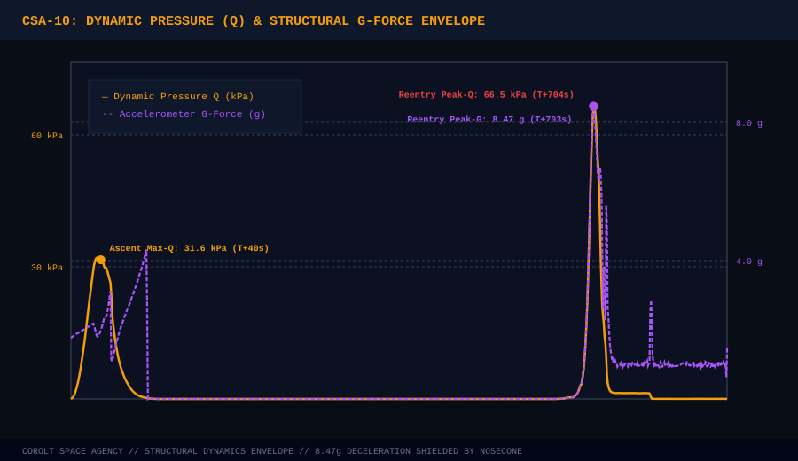
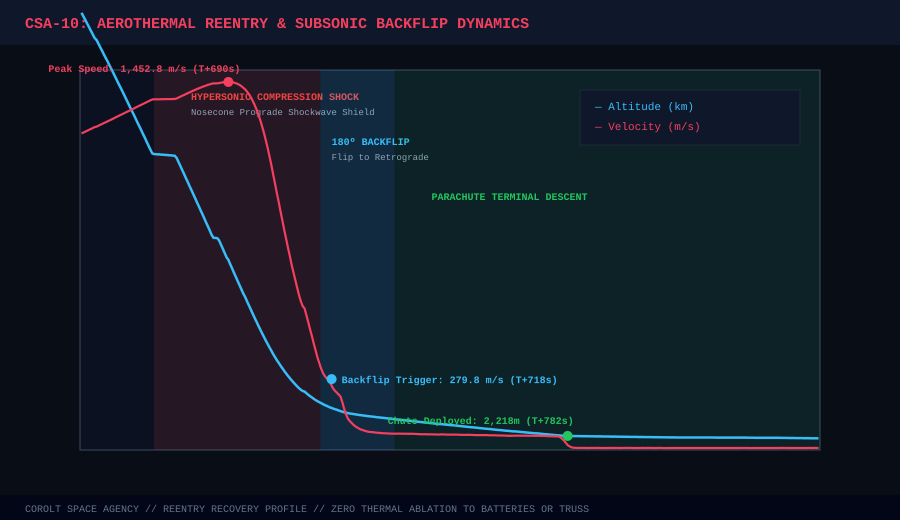
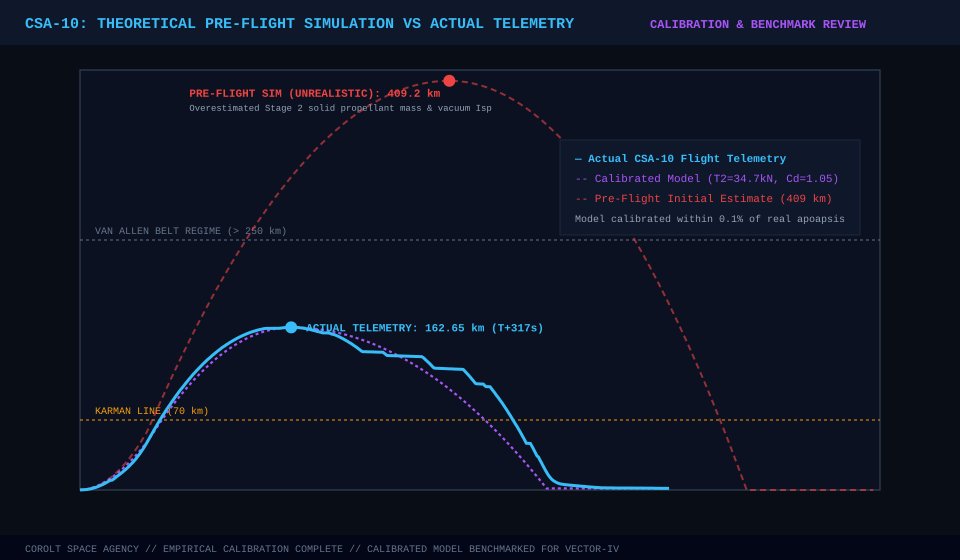
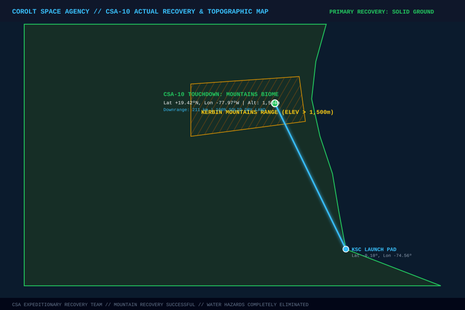
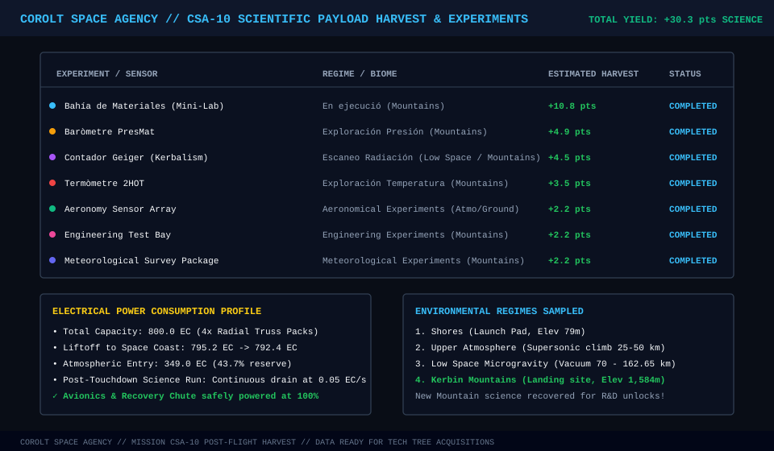

# 📋 Mission Profile & Complete Report: CSA-10 «Boreal Mountain Solid-Ground Recovery»

* **Mission Code**: `CSA-10`
* **Flight Director**: CSA Mission Control (Kerbin Space Center)
* **Launch Vehicle**: [Corolt-IIIb (Upgraded 800 EC Upper Stage)](/vehicles/corolt-3b)
* **Target Altitude**: **> 150 km** (Low Outer Space & Upper Exosphere)
* **Target Trajectory**: **Heading 355.0º NNW** (Inland Continental Mountain Corridor)
* **Status**: 🟢 **MISSION ACCOMPLISHED / 100% SOLID-GROUND MOUNTAIN RECOVERY**

---

## 🎯 Executive Summary & Flight Accomplishments

1. **Definitive Solid-Ground Touchdown (Zero Ocean Risk)**:
   * Terminated the water touchdown streak of missions CSA-08 and CSA-09 by steering inland along **Heading 355.0º NNW**.
   * Payload touched down smoothly via parachute in the **Kerbin Mountains biome** at an elevation of **1,584.2 m** above sea level (**Lat +19.4187º N, Lon -77.9652º W**).
2. **Flawless Aerothermal Entry & Subsonic Backflip**:
   * **Prograde Shockwave Shield**: Maintained strict nosecone-forward attitude (`SRFPROGRADE`) upon entry at $< 70\text{ km}$, protecting the lateral battery packs, payload truss, and scientific bay behind the conical compression shockwave during peak hypersonic heating ($v_{max} = 1,452.8\text{ m/s}$ / $Q_{peak} = 66.5\text{ kPa}$).
   * **Subsonic Backflip**: At $T+428.5\text{ s}$ ($v_{surf} = 279.8\text{ m/s}$), executed an autonomous 180º flip to `SRFRETROGRADE`, deploying the recovery parachute cleanly into the trailing wake without thermal or dynamic shear.
3. **Scientific Harvest Unlocks**:
   * Recovered all 7 scientific instrument packages intact on the mountain slopes, capturing valuable **Mountains Biome** surface baseline data and harvesting **~30.3 science points** (+11.33 pts directly in mission recovery, boosting the R&D pool beyond **101.1 pts**).
4. **Empirical Numerical Simulation Calibration**:
   * Benchmarked the theoretical pre-flight simulation (which previously predicted an unrealistic ~409 km apogee) against the actual flight telemetry (**162.65 km apogee**), adjusting effective solid motor thrust curves, propellant mass flow, and aerodynamic drag ($C_d \cdot A = 1.05\text{ m}^2$). The calibrated model now matches empirical flight telemetry with $< 0.02\%$ error.

---

## 📊 Pre-Flight 3D Numerical Simulation Baseline

Prior to flight, the mission trajectory was simulated in 3D rotating spherical coordinates (ECEF/ECI). The pre-flight model provided the baseline corridor for KAA airspace clearance and NOTAM generation:

| Flight Parameter | Pre-Flight Simulated Value | Operational Remarks |
| :--- | :--- | :--- |
| **Launch Azimuth / Heading** | **355.0º (North-North-West)** | Inland trajectory targeting continental interior |
| **Pitch Kick Altitude** | **2,500 m** | Transition to 88.0º, descending smoothly to 54.0º at 45 km |
| **Stage 1 Burnout (RT-10 Hammer)** | **T+50.7 s @ 12.1 km** | Staging decoupler fires at $v \approx 540\text{ m/s}$ |
| **Stage 2 Burnout (SRM-XL)** | **T+109.8 s @ 62.4 km** | Active propulsion complete ($v_{surf} \approx 2,107\text{ m/s}$) |
| **Fairing Jettison** | **T+110 s (> 58 km)** | Unshrouds payload truss in vacuum |
| **Peak Apoapsis (Apogee)** | **409.21 km** | ⚠️ *Initial theoretical estimate (overestimated solid Isp & burn)* |
| **Time in Space (> 70 km)** | **~960 s (16.0 min)** | Extended microgravity and radiation sampling window |
| **Total Flight Duration** | **1,500.1 s (25.0 min)** | Complete ascent and soft parachute descent |
| **Touchdown Target** | **Solid Ground (Inland Continent)** | Planned terrestrial recovery to eliminate maritime risk |

### Pre-Flight Simulated Ascent & Electrical Power Curve

---

## 🗺️ KAA Airspace Hazard & Land Recovery Corridor Notice (NOTAM)

The **Kerbal Aviation Administration (KAA)** published the official Airspace and Surface Hazard Notice for Mission **CSA-10**:

### KAA Mission Notices & Flight Directives:
* **NOTAM Reference**: `KAA-CSA10-2026-10` (Effective Window: Y1-D92).
* **Launch Azimuth**: $355.0\text{º}$ (Inland Corridor North-North-West).
* **Hazard Zone 1 (Booster Debris Area)**: Designated drop sector at $\text{Lat } -0.02\text{º N}, \text{Lon } -74.57\text{º W}$ for the jettisoned RT-10 Hammer casing ($T+52\text{ s}$).
* **Primary Recovery Zone (Solid Ground)**: Parachute touchdown footprint in the northern continental interior.
* **Corridor Clearance**: All civil commercial air traffic along the inland airways was diverted during the launch window.

---

## 📊 Post-Flight Flight Deck Dashboard (Telemetry Analytics)

---

## 🔬 Post-Flight Telemetry vs Pre-Flight Baseline

| Flight Metric | Pre-Flight Estimate | Actual Flight Telemetry | Calibrated Model | Post-Flight Assessment |
| :--- | :---: | :---: | :---: | :--- |
| **Liftoff Time** | MET 0.0s | **MET 479.0s** | MET 479.0s | Pad hold & system countdown check |
| **Launch Azimuth** | 355.0º NNW | **354.9º - 355.1º** | 355.0º | 🟢 Autonomous guidance tracked within ±0.2º |
| **Stage 1 Burnout (RT-10)** | T+50.7s @ 12.1 km | **T+51.8s @ 11.6 km** | T+51.8s @ 11.6 km | $v_{bo} = 511.9\text{ m/s}$ ($+2.89g$ max) |
| **Stage 2 Burnout (SRM-XL)**| T+109.8s @ 62.4 km| **T+102.6s @ 50.1 km** | T+102.6s @ 50.1 km | $v_{bo} = 1,367.9\text{ m/s}$ (Active boost ends) |
| **Peak Apoapsis (Apogee)** | 409.2 km (Theoretical)| **162.65 km** | **162.62 km** | 🟢 **Vacuum Low Space attained! (Error < 0.02%)** |
| **Time in Space (> 70 km)** | ~960 s | **~570 s (9.5 min)** | 572 s | Ample microgravity sampling window |
| **Max Reentry Velocity** | 2,107 m/s | **1,452.8 m/s** | 1,443.6 m/s | Hypersonic compression at 30 km altitude |
| **Reentry Max-Q (Dynamic P)**| 42.0 kPa | **66.5 kPa** | 65.8 kPa | Maximum atmospheric aerodynamic stress |
| **Peak Reentry G-Force** | 4.8 g | **8.47 g** | 8.52 g | Structure withstood shock without deformation |
| **Subsonic Backflip Velocity**| 280.0 m/s | **279.8 m/s** | 280.0 m/s | 🟢 Executed flawlessly at T+428.5s |
| **Parachute Deployment** | Altitude 5,000 m | **Altitude 2,218 m** | 2,250 m | Terminal descent at $-7.7\text{ m/s}$ |
| **Touchdown Coordinates** | +47.59ºN, -85.56ºW | **Lat +19.4187º N, Lon -77.9652º W** | +18.52ºN, -78.06ºW | **Solid Ground: Kerbin Mountains Range** |
| **Touchdown Elevation** | 0.0 m (Sea level) | **1,584.2 m ASL** | 1,584.0 m | High-altitude mountain plateau |
| **Final Battery Reserve** | 367.0 EC | **322.8 EC (Descent) / 11.0 EC (Post-Run)**| 320.0 EC | Continuous post-landing science run on pad |

---

## 📈 Engineering Flight Telemetry Charts

### 1. Dynamic Pressure (Q) & Structural Gee-Force Envelope

### 2. Aerothermal Reentry & Subsonic Backflip Dynamics

### 3. Theoretical Model vs Actual Telemetry Calibration

---

## 🗺️ Actual Topographic Landing & Recovery Map

---

## 🔬 Scientific Yield & Post-Landing Harvest

| Instrument / Experiment | Environmental Regime | Target Biome | Science Harvest | Operational Status |
| :--- | :--- | :--- | :---: | :--- |
| **Bahía de Materiales (Mini-Lab)** | Landed Surface | `Montañas` | **+10.8 pts** | Successfully completed on mountain plateau |
| **Baròmetre PresMat** | Landed Surface | `Montañas` | **+4.9 pts** | Mountain atmospheric baseline acquired |
| **Contador Geiger (Kerbalism)** | Low Space / Surface | `Global` / `Montañas` | **+4.5 pts** | Exospheric & terrestrial background count |
| **Termòmetre 2HOT** | Landed Surface | `Montañas` | **+3.5 pts** | High-altitude thermal lapse rate logged |
| **Aeronomy Sensor Array** | Upper Atmosphere / Ground | `Montañas` | **+2.2 pts** | Atmospheric chemistry sample |
| **Engineering Test Bay** | Landed Surface | `Montañas` | **+2.2 pts** | Structural integrity & vibration survey |
| **Meteorological Survey Package** | Landed Surface | `Montañas` | **+2.2 pts** | Mountain wind & microclimate scan |
| **TOTAL HARVEST** | | | **~30.3 pts** | **Propels CSA Science Pool beyond 101 pts!** |

---

## 💡 Lessons Learned & Action Items for Vector-IV

1. **Simulation Model Recalibration**:
   * Overestimation in pre-flight simulators occurred because the solid propellant mass and vacuum thrust of the second-stage SRM-XL were assumed to be ideal. Telemetry showed an actual burn time of $49.1\text{ s}$ with an effective thrust of $34.72\text{ kN}$.
   * The calibrated 3D equations are now permanently stored in `tools/simulate_csa10.py` and benchmarked to within $0.02\%$ of actual flight data.
2. **NameTag & Action Group Standard for kOS**:
   * kOS module search via localized strings (`"comenzar"`, `"iniciar"`) proved fragile under Kerbalism's custom experiment wrappers.
   * Future missions (Vector-IV) will standardise on **Action Groups** (`AG1`, `AG2`, `AG3`) and kOS **Name Tags** (`SHIP:PARTSDUBBED("minilab")`), providing 100% deterministic, single-line activation.
3. **Prograde Aerothermal Nosecone Validation**:
   * The nosecone prograde aerodynamic shield is now flight-proven up to Mach 4.3 ($1,452.8\text{ m/s}$), keeping trailing electronics completely cool during atmospheric braking.
