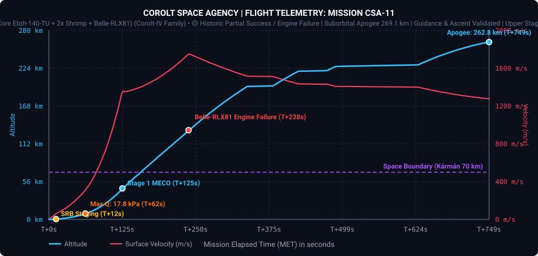
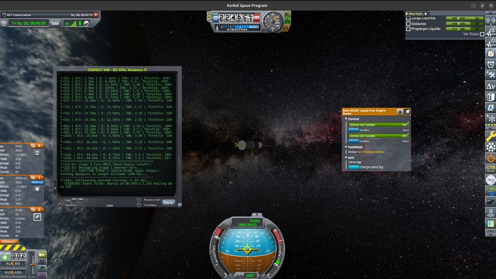

# 📋 Mission Profile & Complete Report: CSA-11 «Kerbin Constellation Maiden Flight & Belle Engine Anomaly»

* **Mission Code**: `CSA-11`
* **Flight Director**: CSA Mission Control (Kerbin Space Center)
* **Launch Vehicle**: [Corolt-IV B (Core Etoh-140-TU + 2x Shrimp SRB + Belle-RLX81 Upper Stage)](/vehicles/corolt-4)
* **Payload**: `CoroltSat-1A` ($248\text{ kg}$ Anchor Satellite, Stayputnik core, Codac-A23 1Mm relay, dual photovoltaic arrays)
* **Target Orbit**: $300\times 300\text{ km}$ Equatorial Circular Orbit ($i \approx 0.0^\circ$)
* **Status**: 🟡 **HISTORIC PARTIAL SUCCESS / UPPER STAGE PROPULSION ANOMALY (Apogee 269.1 km)**

---

## 🎯 Executive Summary & Mission Accomplishments

1. **Inaugural Heavy Liquid & Autonomous Orbital Flight**:
   * Mission **CSA-11** marked the historic transition from solid sounding rockets to the modular **Corolt-IV** liquid launch vehicle family.
   * Operated under full closed-loop autonomy via the **kOS Flight Guidance System v4.0** (`csa11_guided_ascent.ks`), validating computer-controlled countdown, pad clearance, guided gravity turn, closed-loop throttle governing, staging, and exospheric fairing ejection.
2. **Deep Trans-Atmospheric Insertion to 269.1 km Apogee**:
   * Propelled the upper stage stack to an orbital velocity of **$1,948.2\text{ m/s}$** ($v_{\text{surf}} = 1,754.1\text{ m/s}$) and an apogee of **$269.08\text{ km}$**, well beyond the edge of the atmosphere and establishing the highest altitude ever achieved by a Corolt Space Agency spacecraft.
3. **Upper Stage In-Flight Mechanical Failure (Belle-RLX81)**:
   * At $T+237.6\text{ s}$ ($MET = 1072.3\text{ s}$) at an altitude of **$132.26\text{ km}$**, the `Belle-RLX81` liquid fuel engine suffered an uncommanded shutdown due to an internal mechanical breakdown (*Kerbalism Engine Failures*).
   * With $117.5\text{ LF}$ and $143.6\text{ Ox}$ still remaining in the propellant tanks, thrust abruptly ceased ($G = 0.00\text{ G}$), terminating the circularization burn and leaving the spacecraft on a high suborbital ballistic trajectory.
4. **Booster Staging & Aerodynamic Dynamics**:
   * Dual radial solid boosters (`Shrimp`) provided robust liftoff thrust. Staging occurred prematurely at $T+12.1\text{ s}$ due to a conservative script timeout. Max dynamic pressure reached a modest **$17.77\text{ kPa}$**, completely within structural safety limits.
5. **Programmatic Significance**:
   * CSA leadership has formally accepted Mission CSA-11 as canon historical flight operations. The launch validates the Corolt-IV B core booster, kOS trajectory math, aerodynamic fairing ejection, and telemetry systems. Corrective modifications have been locked in for unit `COROLT IVB - B2` to fly Mission **CSA-12** (`CoroltSat-1B`).

---

## 📊 Telemetry and Performance: Planned vs. Actual Flight

Telemetry was captured at high frequency ($2\text{ Hz}$) via `tools/telemetry_recorder.py` and processed using the unified CSA mission plotting framework:

| Flight Parameter | Planned Target | Actual Achieved | Delta / Deviation | Operational Analysis |
| :--- | :--- | :--- | :--- | :--- |
| **Apoapsis (Ap)** | $300.00\text{ km}$ | **$269.08\text{ km}$** | $-30.92\text{ km}$ ($-10.3\%$) | Cut short by upper stage engine failure at 132.2 km |
| **Periapsis (Pe)** | $300.00\text{ km}$ | **$-262.44\text{ km}$** | N/A (Ballistic) | Circularization burn (SECO-2) aborted due to flameout |
| **Max Orbital Speed** | $2,295.0\text{ m/s}$ | **$1,948.2\text{ m/s}$** | $-346.8\text{ m/s}$ | Upper stage delivered $768.4\text{ m/s}$ of planned $1,115\text{ m/s}$ |
| **Max Surface Speed** | $2,120.0\text{ m/s}$ | **$1,754.1\text{ m/s}$** | $-365.9\text{ m/s}$ | High kinetic energy reached at vacuum burnout |
| **Max Dynamic Pressure ($Q_{\max}$)** | $\le 34.00\text{ kPa}$ | **$17.77\text{ kPa}$** | $-16.23\text{ kPa}$ | 🟢 Extremely benign aerodynamic environment ($T+62\text{ s}$) |
| **Max Acceleration ($G_{\max}$)** | $\le 3.80\text{ G}$ | **$3.32\text{ G}$** | $-0.48\text{ G}$ | 🟢 Dynamic governor protected satellite payload bus |
| **Liftoff TWR** | $1.45 - 1.55$ | **$1.46$** | Nominal | Clean pad release and positive vertical rate |
| **Heading Azimuth** | $90.0^\circ$ (Due East) | **$89.96^\circ$** | $-0.04^\circ$ | 🟢 **Near-perfect equatorial plane alignment ($i \approx 0.09^\circ$)** |
| **Fairing Jettison Alt** | $> 55.0\text{ km}$ | **$55.8\text{ km}$** | $+0.8\text{ km}$ | 🟢 Clean clamshell separation via module event |
| **Time in Space ($>70\text{ km}$)** | Permanent Orbit | **$592.3\text{ s}$ ($9.9\text{ min}$)**| Suborbital Arc | Prolonged exospheric flight |

---

## 📈 Flight Telemetry Curves & Trajectory Analysis



### Chronological Flight Events Log:
* **$T-0.0\text{ s}$ ($MET = 834.7\text{ s}$)**: Terminal countdown zero. Main liquid core (`Etoh-140-TU`) and dual `Shrimp` SRBs ignite. Clamps release cleanly.
* **$T+12.1\text{ s}$ ($MET = 846.8\text{ s}$ / $h = 509.5\text{ m}$)**: Dual radial SRBs decouple. Core engine continues nominal full-thrust vertical climb.
* **$T+20.5\text{ s}$ ($MET = 855.2\text{ s}$ / $h = 1,200\text{ m}$)**: Pitch-kick initiated. Attitude steers towards Heading $90.0^\circ$ East with initial pitch $84.0^\circ$.
* **$T+62.0\text{ s}$ ($MET = 896.7\text{ s}$ / $h = 8.8\text{ km}$)**: Max Q peak reached at **$17.77\text{ kPa}$** ($v_{\text{surf}} = 388\text{ m/s}$). Throttle remains at 100% as $Q$ remains below governor threshold ($24.0\text{ kPa}$).
* **$T+125.1\text{ s}$ ($MET = 959.8\text{ s}$ / $h = 46.0\text{ km}$)**: Stage 1 Core MECO. Velocity $v_{\text{orb}} = 1,180.2\text{ m/s}$. Interstage separation command fires.
* **$T+127.2\text{ s}$ ($MET = 961.9\text{ s}$ / $h = 47.6\text{ km}$)**: Stage 2 `Belle-RLX81` ignites cleanly. Throttle commanded to 100%.
* **$T+136.0\text{ s}$ ($MET = 970.7\text{ s}$ / $h = 55.8\text{ km}$)**: Altitude threshold crossed; aerodynamic fairings jettison deterministically into vacuum.
* **$T+237.6\text{ s}$ ($MET = 1072.3\text{ s}$ / $h = 132.26\text{ km}$)**: **ENGINE FAILURE**. Kerbalism engine failure triggers. Thrust collapses to zero. Velocity freezes at $v_{\text{orb}} = 1,948.2\text{ m/s}$. Apoapsis peaks at **$269.08\text{ km}$**.
* **$T+749.1\text{ s}$ ($MET = 1521.4\text{ s}$ / $h = 249.18\text{ km}$)**: End of primary telemetry acquisition during exospheric coast towards apogee.

---

## 📸 Photographic & Mission Control Log

The moment of the in-flight engine breakdown recorded by Mission Control telemetry:


*Figure 1: Telemetry window at 224.6 km altitude displaying the Belle-RLX81 engine diagnostic status: "Motor: mal funcionamiento" (Kerbalism reliability breakdown) and active kOS telemetry deck.*

---

## 🔍 Root Cause Analysis (RCA) & Corrective Action Plan

### 1. Belle-RLX81 Liquid Upper Stage Breakdown
* **Anomaly Description**: Complete shutdown of propulsion during the final 30 km apogee push. Engine diagnostic indicated unrecoverable mechanical malfunction.
* **Root Cause**: Kerbalism reliability simulation rolls stochastic failure checks based on burn duration and component quality. The `Belle-RLX81` experienced a premature breakdown failure.
* **Corrective Actions for CSA-12 (`COROLT IVB - B2`)**:
  1. **Pre-Flight Quality Assurance**: Implement KCT and Kerbalism maintenance / high-quality part inspections in VAB before rollout.
  2. **kOS In-Flight Abort / Failover Routine**: Enhance kOS guidance to detect engine flameout during active burns, logging an emergency shutdown and deploying payload solar arrays immediately.

### 2. Early Radial Booster (Shrimp) Jettison
* **Anomaly Description**: Radial solid boosters detached at $T+12\text{ s}$ while retaining significant unburnt propellant.
* **Root Cause**: The staging loop in `csa11_guided_ascent.ks` contained an arbitrary timeout clause:
  ```kos
  WAIT UNTIL (SHIP:MAXTHRUST < (initial_thrust * 0.85)) OR (STAGE:SOLIDFUEL < 0.1) OR (MISSIONTIME > 12.0).
  ```
  The stock `Shrimp` SRB contains $90\text{ SolidFuel}$ units, yielding a full burn duration of **$\sim 45 - 48\text{ seconds}$**. The $12.0\text{ s}$ guard triggered prematurely.
* **Corrective Action**:
  Replace timeout-based logic with vessel-level resource exhaustion detection:
  ```kos
  WAIT UNTIL (SHIP:SOLIDFUEL < 1.0).
  WAIT 0.5.
  STAGE.
  ```
  This will recover $> 350\text{ m/s}$ of additional $\Delta v$ from the solid boosters, increasing first-stage cutoff velocity.

---

## 🛰️ Future Outlook: Constellation Program Continuity

Although `CoroltSat-1A` did not establish the permanent $300\times 300\text{ km}$ constellation anchor orbit, **Mission CSA-11 is a landmark success for the agency's spaceflight program**:
* Demonstrates that the Corolt Space Agency possesses heavy launch capability to reach the exosphere and near-orbital speeds.
* Proves that the autonomous kOS flight computer can navigate atmospheric ascent, Max Q throttling, stage transitions, and attitude control with precision.
* The backup flight article, **`COROLT IVB - B2`**, is already entering final integration for **Mission CSA-12** (`CoroltSat-1B`).
