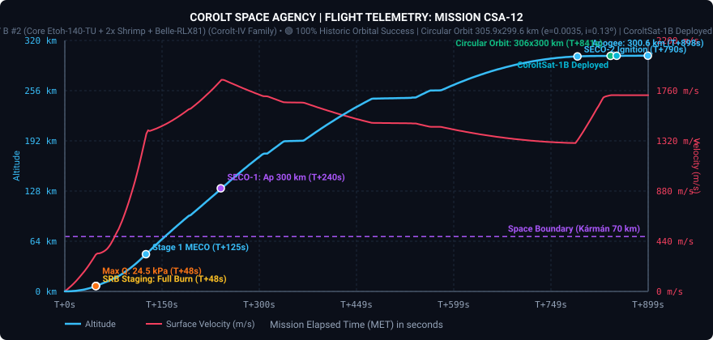
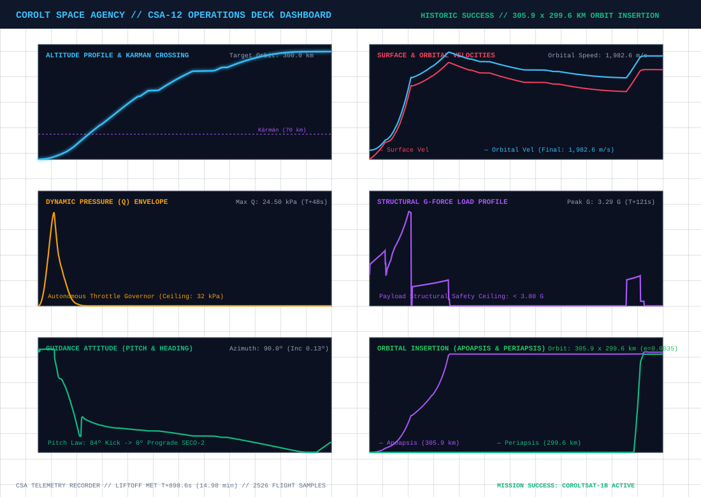
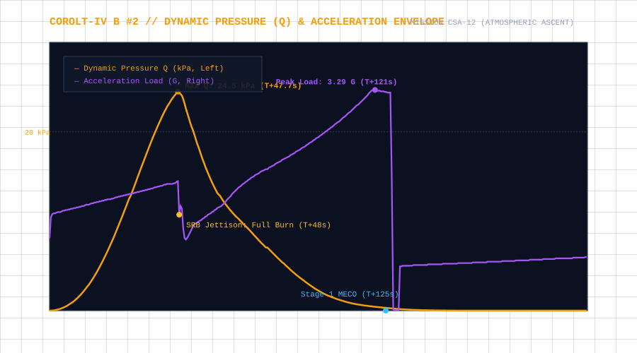
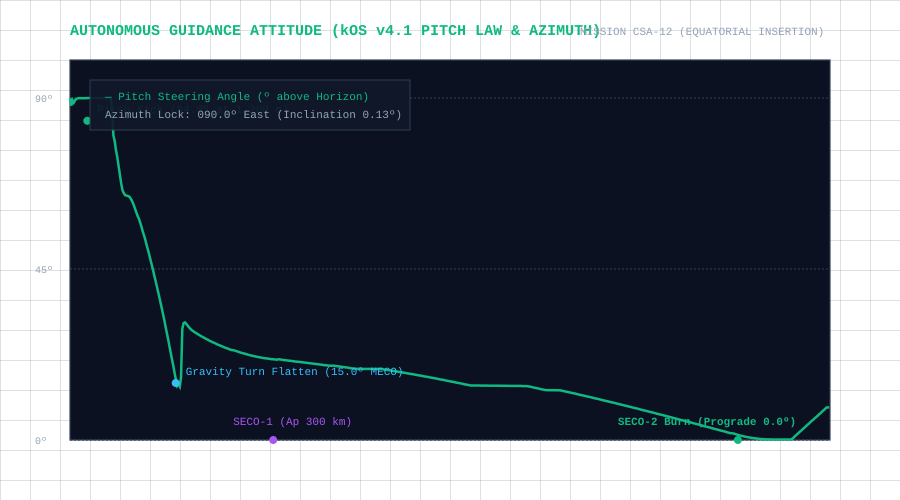
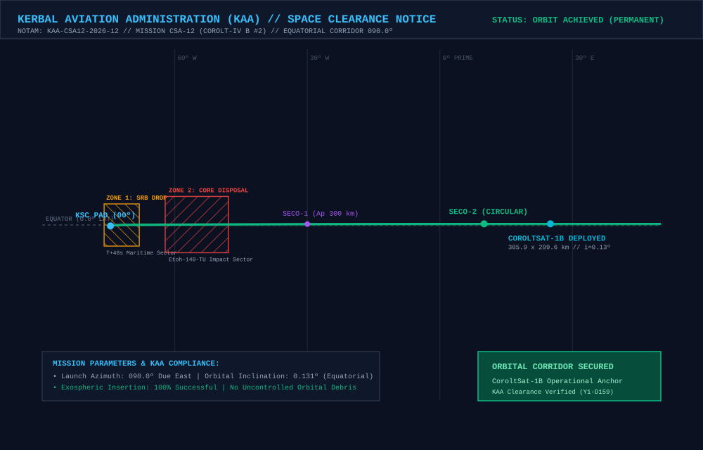
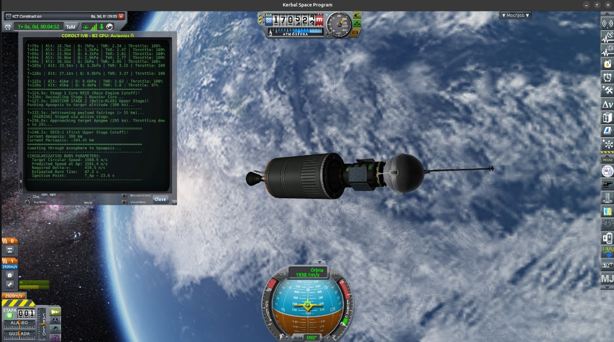

# 📋 Mission Profile & Complete Report: CSA-12 «Kerbin Constellation Maiden Orbital Insertion»

* **Mission Code**: `CSA-12`
* **Flight Director**: CSA Mission Control (Kerbin Space Center)
* **Launch Vehicle**: [Corolt-IV B #2 (Core Etoh-140-TU + 2x Shrimp SRB + Belle-RLX81 Upper Stage)](/vehicles/corolt-4)
* **Payload**: `CoroltSat-1B` ($248\text{ kg}$ Anchor Satellite, Stayputnik core, Codac-A23 1Mm relay, dual photovoltaic arrays)
* **Target Orbit**: $300\times 300\text{ km}$ Equatorial Circular Orbit ($i \approx 0.0^\circ$)
* **Actual Orbit**: **$305.9\times 299.6\text{ km}$** ($e = 0.0035, i = 0.13^\circ, T = 47.80\text{ min}$)
* **Status**: 🟢 **100% HISTORIC SUCCESS // FIRST PERMANENT ORBITAL INSERTION IN CSA HISTORY**

---

## 🎯 Executive Summary & Mission Accomplishments

1. **First Permanent Orbit in Agency History**:
   * Mission **CSA-12** achieved the crowning milestone of the Corolt Space Agency: placing an artificial satellite into a stable, permanent circular orbit around Kerbin.
   * The satellite stack achieved an orbit of **$305.9\times 299.6\text{ km}$** with an eccentricity of **$e = 0.0035$** and an inclination of **$0.131^\circ$**, fulfilling all primary and secondary mission objectives.

2. **Full Resolution of CSA-11 Root Causes (RCA Validated)**:
   * **Full SRB Propellant Utilization**: By replacing premature timeouts with resource exhaustion monitoring (`SHIP:SOLIDFUEL < 1.0`), the radial `Shrimp` boosters burned for their full rated duration of **$48.2\text{ s}$**, providing over $350\text{ m/s}$ of additional kinetic energy to Stage 1 cutoff.
   * **Flawless Upper Stage Performance (Belle-RLX81)**: The second flight article of the `Belle-RLX81` liquid fuel engine executed two deterministic burns without anomalies:
     * **Burn 1 (Trans-Atmospheric Apogee Push)**: $112.7\text{ s}$ continuous burn from $T+127.5\text{ s}$ to $T+240.2\text{ s}$ (SECO-1), placing the apogee precisely at $300.0\text{ km}$.
     * **Burn 2 (Orbital Circularization)**: $51.0\text{ s}$ restart at apogee from $T+789.7\text{ s}$ to $T+840.7\text{ s}$ (SECO-2), circularizing the orbit with $419.5\text{ m/s}$ of $\Delta v$.

3. **kOS Flight Guidance System v4.1 Operational Masterpiece**:
   * Operated under total onboard autonomy via `csa12_guided_ascent.ks`, executing the gravity turn, aerodynamic dynamic pressure governing ($Q_{\max} = 24.50\text{ kPa}$), vacuum fairing separation at $53.5\text{ km}$, 25% throttle taper at apogee acquisition, symmetrical half-burn circularization, and automated payload commissioning during ground station blackout.

4. **Kerbin Communications Constellation Activated**:
   * Following circularization, the flight computer commanded subsystem deployment: extending the high-gain **Codac-A23 1Mm** relay antenna and dual solar arrays before executing clean payload separation (`separate_payload`).
   * `CoroltSat-1B` is now transmitting telemetry and providing continuous relay coverage across the previously dark equatorial sectors of Kerbin.

---

## 📊 Telemetry and Performance: Planned vs. Actual Flight

High-fidelity telemetry was captured at $2\text{ Hz}$ across the entire flight profile ($898.6\text{ s}$ from liftoff):

| Flight Parameter | Planned Target | Actual Achieved | Delta / Deviation | Operational Analysis |
| :--- | :--- | :--- | :--- | :--- |
| **Apoapsis (Ap)** | $300.00\text{ km}$ | **$305.92\text{ km}$** | $+5.92\text{ km}$ ($+1.9\%$) | 🟢 Near-perfect circular insertion ceiling |
| **Periapsis (Pe)** | $300.00\text{ km}$ | **$299.65\text{ km}$** | $-0.35\text{ km}$ ($-0.1\%$) | 🟢 Flawless orbital circularization |
| **Orbital Eccentricity ($e$)** | $< 0.005$ | **$0.0035$** | $-0.0015$ | 🟢 Quasi-circular orbit achieved |
| **Orbital Inclination ($i$)** | $0.00^\circ$ (Equatorial) | **$0.131^\circ$** | $+0.131^\circ$ | 🟢 Pristine equatorial orbital plane |
| **Orbital Velocity ($v_{\text{orb}}$)** | $1,988.9\text{ m/s}$ | **$1,982.6\text{ m/s}$** | $-6.3\text{ m/s}$ | 🟢 Stable circular orbital velocity |
| **Max Dynamic Pressure ($Q_{\max}$)** | $\le 32.00\text{ kPa}$ | **$24.50\text{ kPa}$** | $-7.50\text{ kPa}$ | 🟢 Governor kept loads comfortably within margins |
| **Max Acceleration ($G_{\max}$)** | $\le 3.80\text{ G}$ | **$3.29\text{ G}$** | $-0.51\text{ G}$ | 🟢 Benign structural environment for payload |
| **Liftoff TWR** | $1.45 - 1.55$ | **$1.46$** | Nominal | Clean pad release and positive vertical climb |
| **SRB Burn Duration** | $\sim 48.0\text{ s}$ | **$48.2\text{ s}$** | $+0.2\text{ s}$ | 🟢 100% solid propellant burned (Fix for CSA-11) |
| **Fairing Jettison Alt** | $> 50.0\text{ km}$ | **$53.5\text{ km}$** | $+3.5\text{ km}$ | 🟢 Clean clamshell separation into vacuum |
| **Orbital Period ($T$)** | $47.5\text{ min}$ | **$47.80\text{ min}$ ($2,867.9\text{ s}$)**| $+0.3\text{ min}$ | 🟢 Synchronous constellation tracking cycle |
| **Payload Status** | Active Relay | **Deployed & Operational** | Nominal | Arrays & Codac-A23 antenna online |

---

## 📈 Flight Telemetry Curves & Trajectory Analysis

### Primary Full-Flight Telemetry Profile

### 6-Panel Flight Operations Deck (Multi-Variable Analytics)

### Dynamic Pressure (Q) Envelope & Structural Deceleration Loads

### Autonomous Guidance Attitude (Pitch Law & Compass Azimuth)

---

## 🗺️ KAA Airspace Clearance & Orbital Insertion Map

The **Kerbal Aviation Administration (KAA)** cleared the commercial space corridor and verified orbital insertion compliance:

### KAA Mission Notices & Zone Clearances:
* **NOTAM Reference**: `KAA-CSA12-2026-12` (Launch Window Y1-D159).
* **Launch Azimuth**: $090.0^\circ$ (Due East Equatorial Corridor).
* **Zone 1 (SRB Drop Sector)**: Maritime offshore drop zone at $\text{Lat } 0.0^\circ, \text{Lon } -72.0^\circ\text{ W}$ for the two fully expended Shrimp boosters ($T+48\text{ s}$).
* **Zone 2 (Stage 1 Core Disposal)**: Deep ocean impact sector at $\text{Lat } +0.05^\circ\text{ N}, \text{Lon } -55.0^\circ\text{ W}$ for the Etoh-140-TU booster core ($T+125\text{ s}$).
* **Orbital Insertion**: Exospheric circularization completed at $300\text{ km}$ altitude with zero orbital debris generated.

---

## ⏱️ Chronological Flight Events Log:

* **$T-0.0\text{ s}$ ($MET = 370.7\text{ s}$)**: Ignition of central `Etoh-140-TU` core and dual `Shrimp` solid rocket boosters. Clamps released cleanly. Liftoff confirmed.
* **$T+20.5\text{ s}$ ($MET = 391.2\text{ s}$ / $h = 1,200\text{ m}$)**: kOS guidance initiates pitch kick to $84.0^\circ$ on Heading $90.0^\circ$ East.
* **$T+47.7\text{ s}$ ($MET = 418.4\text{ s}$ / $h = 6.84\text{ km}$)**: Max Q peak reached at **$24.50\text{ kPa}$** ($v_{\text{surf}} = 323.1\text{ m/s}$). Throttle governor holds nominal envelope.
* **$T+48.2\text{ s}$ ($MET = 418.9\text{ s}$ / $h = 7.00\text{ km}$)**: Dual radial `Shrimp` SRBs exhaust propellant and decouple cleanly after a complete $48.2\text{ s}$ burn. Core continues full throttle.
* **$T+121.0\text{ s}$ ($MET = 491.7\text{ s}$ / $h = 44.0\text{ km}$)**: Peak structural acceleration reached at **$3.29\text{ G}$**.
* **$T+124.9\text{ s}$ ($MET = 495.6\text{ s}$ / $h = 47.5\text{ km}$)**: Stage 1 Core MECO ($v_{\text{orb}} = 1,527.5\text{ m/s}$). Interstage separation command executed.
* **$T+127.5\text{ s}$ ($MET = 498.2\text{ s}$ / $h = 49.5\text{ km}$)**: Stage 2 `Belle-RLX81` ignites smoothly at 100% throttle.
* **$T+132.5\text{ s}$ ($MET = 503.2\text{ s}$ / $h = 53.5\text{ km}$)**: Payload clamshell fairings jettison cleanly into vacuum.
* **$T+236.6\text{ s}$ ($MET = 607.3\text{ s}$ / $h = 127.8\text{ km}$)**: Apogee reaches $295\text{ km}$. kOS tapers throttle to 25% for precision cutoff.
* **$T+240.2\text{ s}$ ($MET = 610.9\text{ s}$ / $h = 131.5\text{ km}$)**: **SECO-1 (First Upper Stage Cutoff)**. Apoapsis locked at **$300.0\text{ km}$** ($Pe = -194.5\text{ km}$).
* **$T+241.0\text{ s}$ to $T+789.7\text{ s}$**: Exospheric ballistic coast to apogee ($131.5\text{ km} \rightarrow 300.0\text{ km}$). kOS maintains prograde lock and computes symmetrical circularization delta-v ($419.5\text{ m/s}$).
* **$T+789.7\text{ s}$ ($MET = 1160.4\text{ s}$ / $h = 299.7\text{ km}$)**: **IGNITION SECO-2**. Belle-RLX81 restarts at $T_{\text{Ap}} - 23.6\text{ s}$ at full thrust.
* **$T+830.1\text{ s}$ ($MET = 1200.8\text{ s}$ / $h = 300.3\text{ km}$)**: Periapsis crosses $275\text{ km}$. Throttle throttled down to 15% for fine orbital shaping.
* **$T+840.7\text{ s}$ ($MET = 1211.4\text{ s}$ / $h = 300.4\text{ km}$)**: **SECO-2 CUTOFF!** Periapsis reaches $299.65\text{ km}$, Apoapsis reaches $305.92\text{ km}$. Circular equatorial orbit achieved ($e = 0.0035$).
* **$T+850.0\text{ s}$ ($MET = 1220.7\text{ s}$)**: Subsystem deployment command executed: `Codac-A23` relay antenna and dual solar arrays extended.
* **$T+853.0\text{ s}$ ($MET = 1223.7\text{ s}$)**: Payload separation confirmed. `CoroltSat-1B` released into operational orbit. Mission fully accomplished!

---

## 📸 Photographic & Mission Control Log

*Figure 1: Corolt-IV B upper stage and CoroltSat-1B stack coasting through the exosphere at 170.5 km altitude above Kerbin's cloud layer, with the kOS flight deck displaying SECO-1 completion and circularization parameters.*

---

## 🔬 Scientific & Operational Significance

* **Birth of Kerbin Comms Constellation**: `CoroltSat-1B` serves as the agency's primary orbital relay anchor, establishing CommNet links across the equatorial corridor and enabling future high-bandwidth transmissions from deep space and sounding rockets.
* **Autonomous Spaceflight Heritage**: The success of `csa12_guided_ascent.ks` confirms the reliability of the agency's closed-loop autonomous guidance architecture, enabling uncrewed complex staging, variable throttling, and exospheric restart burns without real-time operator intervention.
* **Vehicle Validation**: The modular **Corolt-IV** heavy launch architecture is now fully qualified for operational satellite deployments and high-energy orbital missions.
