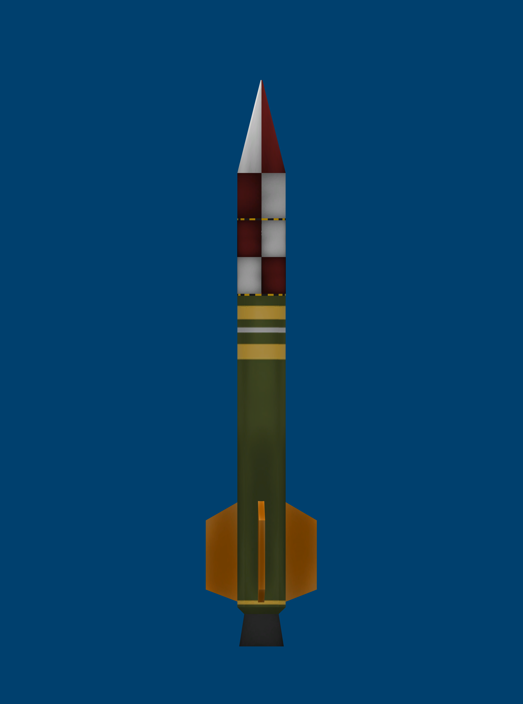

# 🚀 Llançador Suborbital: Corolt-Ib (CSA-02)

> *"L'evolució del primer vol: més autonomia elèctrica i control aerodinàmic avançat."*

---

## 📐 Especificacions Tècniques

| Paràmetre | Valor d'Enginyeria |
| :--- | :--- |
| **Fabricant** | Corolt Space Agency (CSA) |
| **Tipus de Vehicle** | Coet Sonda Suborbital Millorat (Sounding Rocket Mod-B) |
| **Diàmetre** | 0.35 m |
| **Massa Total al Llançament** | 0.290 t (290 kg) |
| **Massa en Sec (Sense combustible)** | 0.160 t (160 kg) |
| **Propulsió** | 1x Motor Sòlid SRM-L (*Sounding Rocket Motor*) |
| **Alimentació Elèctrica** | 3x Bateries miniatura d'alta densitat (Power Storage) |
| **Estabilització** | 4x Aletes aerodinàmiques radials (`SR.Wing.03` x4) |
| **Recuperació** | Paracaigudes de càrrega miniatura (Pack Chute) |
| **Objectiu Operatiu** | Validació d'autonomia energètica de telemetria i perfil de caiguda ràpida |

---

## 💡 Millores respecte al model Corolt-I original

1. **Capacitat Elèctrica Triplicada**:
   - Integració de tres mòduls de bateries per assegurar que el disc dur de la computadora i els sensors de Kerbalism mantinguen el flux de dades actiu fins a l'aterratge sense apagar-se.
2. **Estabilitat de Vol (4 Aletes)**:
   - Pas de 3 a 4 aletes en configuració cruciforme radial per corregir qualsevol oscil·lació aerodinàmica durant la fase de màxima empenta.
3. **Perfil de Frenada Retardada**:
   - Desplegament de paracaigudes programat per sota dels 2.000 m per evitar temps morts llargs en l'aire.
