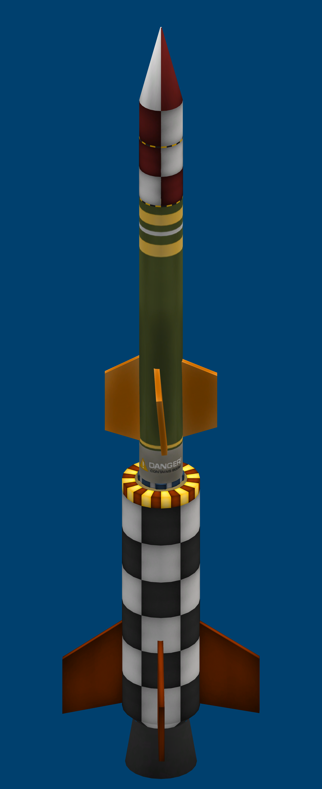
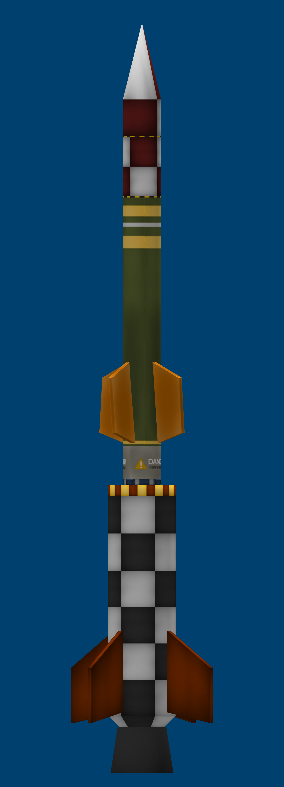
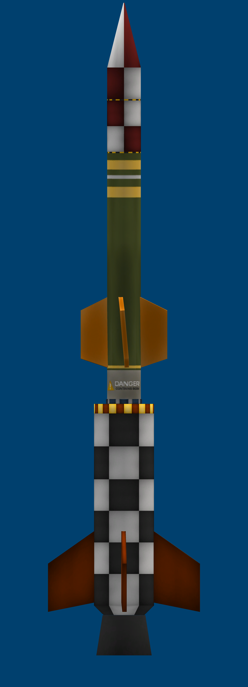

# 🚀 Multi-Stage Launcher: Corolt-II (CSA-03)

> *"Leaping to the edge of space: the first two-stage rocket of the Corolt Space Agency engineered to cross the Kármán line (>70 km)."*



---

## 📐 General Technical Specifications

| Design Parameter | Engineering Value |
| :--- | :--- |
| **Manufacturer** | Corolt Space Agency (CSA) |
| **Vehicle Type** | Two-Stage Suborbital Sounding Rocket |
| **Main Diameter** | 0.625 m (Booster) $\rightarrow$ 0.35 m (Upper Stage) |
| **Gross Launch Mass** | **1.387 t (1,387 kg)** |
| **Final Payload Dry Mass** | **0.167 t (167 kg)** |
| **Peak Liftoff Thrust** | **28.00 kN** |
| **Thrust-to-Weight Ratio (TWR)** | **2.06 (Stage 1 Liftoff)** $\rightarrow$ **2.04 (Stage 2 Ignition)** |
| **Total Delta-v ($\Delta v$)** | **2,205 m/s (Sea Level) / 2,630 m/s (Vacuum)** |
| **Total Burn Time** | **92.3 seconds (58.5s Stage 1 + 33.8s Stage 2)** |
| **Staging Mechanism** | Rapid explosive decoupler `SR.Decoupler` (0.35m) |
| **Recovery System** | Miniature cargo parachute nosecone (`SR.Nosecone.35`) |

---

## 🔬 Staging Architecture

```
[Nosecone + Parachute]
       │
[Science Payload SR.Payload.02 + Battery + Computer]
       │
[Second Stage: Solid Motor SRM-L 0.35m (4x SR.Wing.03 fins)]
       │
[Mini Explosive Decoupler 0.35m]
       │
[First Stage: Booster SRM-XL 0.625m (4x large SR.Wing.02 fins)]
```

### 1. First Stage (Atmospheric Ascent Booster):
* **Motor**: 0.625m SRM-XL (`SR.Rocket.625.01`).
* **Thrust Limiter**: Calibrated to 16% for a gentle, aerodynamically sustained liftoff of **28 kN** (initial TWR of 2.06).
* **Mission**: Punch through the dense troposphere over **58.5 seconds** of steady acceleration, carrying the vehicle above 25,000 meters.
* **Stabilization**: 4 high-temperature fins `SR.Wing.02` mounted at the aft skirt.

### 2. Second Stage (High Altitude / Vacuum Propulsion):
* **Motor**: 0.35m SRM-L (`SR.Rocket.35.02`).
* **Mission**: Ignited immediately upon booster staging, delivering **33.8 seconds** of sustained impulse in thin air to catapult payload into space.
* **Scientific Payload**: New atmospheric and radiation analysis suite **`SR.Payload.02`**, powered by an integrated `SR.Stack.Battery`.

---

## 🛠️ KVV Engineering Blueprints (Kronal Vessel Viewer)

### Cutaway & Internal Staging View


### Aerodynamic Integration Schematic

