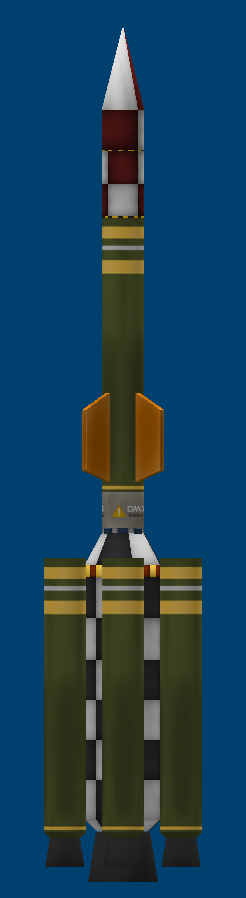
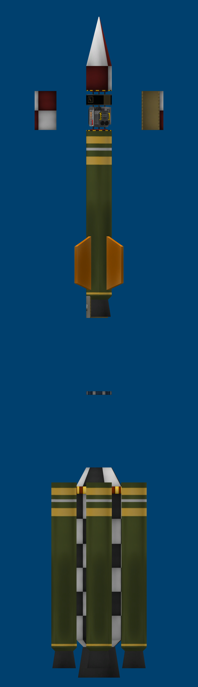

# 🚀 Multi-Stage Launcher: Corolt-IIb (CSA-04)

> *"High-thrust variant with an expanded scientific suite from the Corolt-II program, equipped with auxiliary radial boosters and the agency's first dedicated atmospheric sensors."*

---

## 📐 General Technical Specifications

| Design Parameter | Engineering Value |
| :--- | :--- |
| **Manufacturer** | Corolt Space Agency (CSA) |
| **Vehicle Type** | Multi-Stage Sounding Rocket with Expanded Scientific Payload |
| **Core Diameter** | 0.625 m (SRM-XL Booster) $\rightarrow$ 0.35 m (SRM-L Upper Stage) |
| **Gross Launch Mass** | **2.157 t (2,157 kg)** |
| **Final Payload Dry Mass** | **0.177 t (177 kg)** |
| **Peak Liftoff Thrust** | **52.31 kN** (SRM-XL Core + 4 Auxiliary Radial Boosters) |
| **Thrust-to-Weight Ratio (TWR)** | **2.47 (Liftoff)** $\rightarrow$ **1.67 (Stage 2 Ignition)** |
| **Total Delta-v ($\Delta v$)** | **2,146 m/s (Sea Level) / 2,552 m/s (Vacuum)** |
| **Stage 1 Burn Time** | **49.2 seconds** |
| **Stage 2 Burn Time** | **33.8 seconds** |
| **Stabilization** | 4 aft skirt fins + 4 upper canted fins (spin-stabilization) |
| **Recovery System** | Integrated parachute `SR.PackChute.35` |

---

## 🔬 Onboard Scientific Payload

For the first time in CSA history, the Corolt-IIb integrates the fundamental environmental research triad:
* 🌪️ **PresMat Barometer (`sensorBarometer`)**: High-precision dynamic and static pressure monitoring.
* 🌡️ **2HOT Thermometer (`sensorThermometer`)**: Fast-response ambient temperature sensor.
* 🌦️ **Meteorological Survey Package (`SR.Payload.01`)**: Density profiling and air-column analysis.
* ⚡ **Mini Battery Pack**: 100 EC units ensuring avionics and sensor operations through splashdown/recovery.

---

## 🛠️ KVV Engineering Blueprints (Kronal Vessel Viewer)

### Elevation & Aerodynamic Profile

### Exploded View of Payload & Staging

---

## 📋 Operational Conclusion
Corolt-IIb succeeded in inaugurating physical telemetry collection for the agency while proving that combining radial boosters and rapid forced spin exceeded the structural tolerances of simple surface attachments. The data collected paved the way directly for the development of **Corolt-III**.

