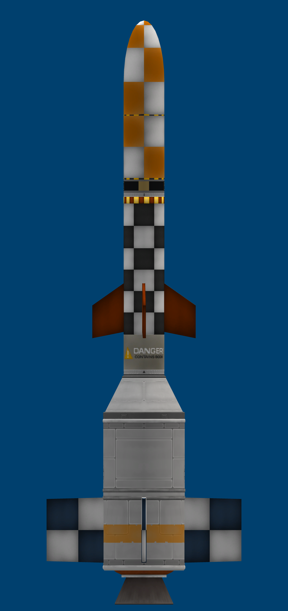
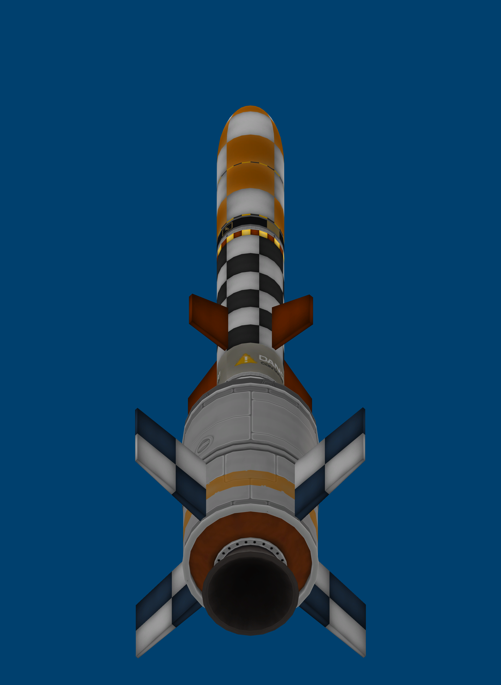
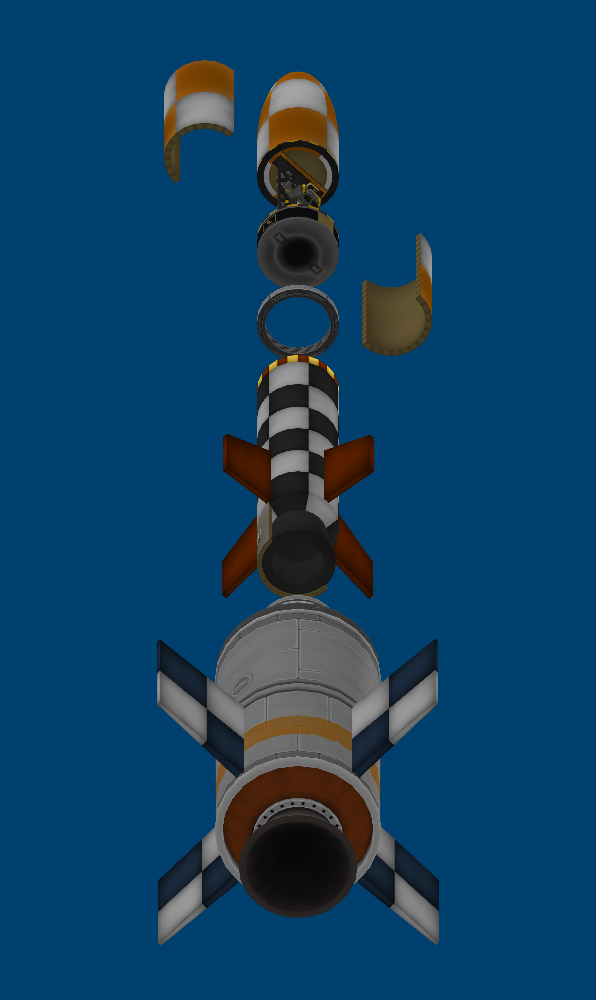
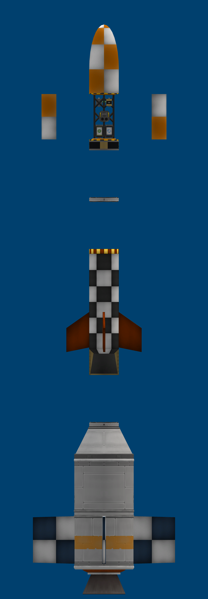

# 🚀 Llançador Pesat en Línia: Corolt-III (CSA-05)

> *"Llançador d'alta cota de nova generació de la CSA, dissenyat en arquitectura purament tàndem (en línia) per superar la baixa atmosfera i assaltar les capes altes de Kerbin."*

---

## 📐 Especificacions Tècniques Generals

| Paràmetre de Disseny | Valor d'Enginyeria |
| :--- | :--- |
| **Fabricant** | Corolt Space Agency (CSA) |
| **Tipus de Vehicle** | Llançador Suborbital Multietapa en Línia (Tàndem) |
| **Diàmetre de Base (Etapa 1)** | **1.25 m** (Booster RT-10 «Hammer») |
| **Diàmetre Superior (Etapa 2)** | **0.625 m** (Motor SRM-XL + Gàbia `SR.PayloadTruss.625`) |
| **Massa Total al Llançament** | **5.144 t (5.144 kg)** |
| **Massa de Càrrega Útil (Dry Mass)** | **0.629 t (629 kg)** |
| **Delta-v ($\Delta v$) Total** | **2.721 m/s (Nivell del mar) / 3.196 m/s (Buit)** |
| **Empenta Inicial (SLT)** | **1.80** (Etapa 1) $\rightarrow$ **2.09** (Etapa 2) |
| **Temps de Combustió Etapa 1** | **51,5 segons** |
| **Temps de Combustió Etapa 2** | **46,8 segons** |
| **Estabilització** | 4 aletes de base `SR_Wing_01` (3.400 K) + 4 aletes superiors `SR_Wing_02` |
| **Recuperació** | Morro cònic amb paracaigudes integrat `SR.Nosecone.625` |

---

## 🔬 Suite Científica i Badia d'Instruments

El Corolt-III estrena la nova badia d'instruments oberta de 0,625 m (`SR.PayloadTruss.625`), que permet exposar directament els sensors al flux atmosfèric tal com requereix Kerbalism:
* ⏱️ **Baròmetre PresMat (`sensorBarometer`)**: Registre de pressió dinàmica i estàtica.
* 🌡️ **Termòmetre 2HOT (`sensorThermometer`)**: Sensor tèrmic de reacció ràpida.
* 🌪️ **Meteorological Survey Package (`SR.Payload.01`)**: Mesura meteorològica d'aire i vent.
* 🧪 **Aeronomy Sensor Array (`SR.Payload.02`)**: Anàlisi de la densitat i composició atmosfèrica.
* ⚡ **Sistema Elèctric Ampliat**: Bateria `batteryBankMini` (100 EC) + 2x bateries `nfex-battery-mini-1` (250 EC totals).
* 💾 **Aviònica Duplicada**: 2x `SR.ProbeCore` actualitzades amb el pegat oficial CSA a 32 MB de memòria cadascuna (64 MB totals).

---

## 🛠️ Esquemes d'Enginyeria KVV (Kronal Vessel Viewer)

### Vista Explosionada i Detall d'Etapes

### Secció de la Badia Científica i Càrrega Útil

### Perfil Estructural i Aerodinàmic

---

## 📋 Conclusió Operativa
El Corolt-III va demostrar una estabilitat aerodinàmica impecable en el seu primer vol durant la missió CSA-05, assolint els 20,43 km fins i tot després d'un incident d'ignició a la segona etapa. Amb la resolució de la fallada tèrmica/fiabilitat i l'actualització de memòria a 32 MB, el vehicle està llest per superar la cota dels 50 km en la campanya **CSA-05b**.

